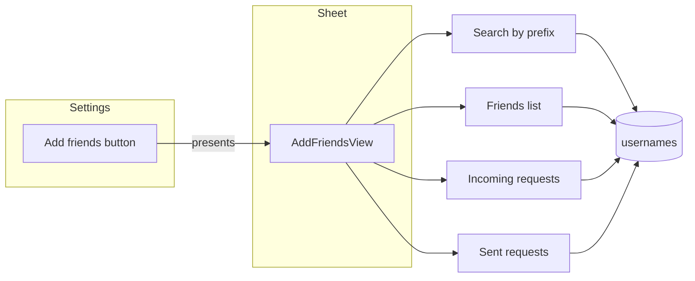

# Add Friends page

## Current state

- **Settings** ([LinkUp/Authentication/SettingsView.swift](LinkUp/Authentication/SettingsView.swift)): "Add friends" opens a **sheet** with `AddFriendsPlaceholderView` (placeholder with "Done").
- **History back button** ([LinkUp/Polls/PollHistoryView.swift](LinkUp/Polls/PollHistoryView.swift)): `navigationBarBackButtonHidden(true)` + `ToolbarItem(placement: .cancellationAction)` with `Button("< Back") { dismiss() }` and `.foregroundStyle(AuthTheme.accent)`.
- **User data**: [AuthModel](LinkUp/Authentication/AuthModel.swift) has `id`, `username`, `email`, `profileImageURL`. Profile images live in Storage `profile_images/{uid}.jpg`; URL is in `users/<uid>` (private — only owner can read). **Usernames** collection: `usernames/<lowercase-username>` with `{ uid }` only; readable by anyone for sign-up check.
- **Firestore rules** ([firestore.rules](firestore.rules)): No friends or friend-requests collections yet.

## Target behaviour

- Add Friends opens from Settings (keep as sheet). Toolbar: **"< Back"** (same style as History) that dismisses the sheet; AuthTheme throughout.
- **Sections**: (1) Search bar at top. (2) **Current friends** list (remove with confirmation). (3) **Friend requests** (incoming: Accept / Reject). (4) **Sent requests** (pending only).
- **Search**: As the user types, query Firestore to filter usernames by prefix; show all matches. If a result is already a friend, show a **subtle** indicator (e.g. small "Friend" label or muted style), not a second "Add" action.
- **Profile pictures**: Each row (friends, requests, search results) shows a small avatar (profile image or initial fallback). This requires exposing profile images for other users (see data model below).

## Data model and security

**1. Profile image for search/display**

- Today only `users/<uid>` has `profileImageURL` and is private. To show other users’ avatars we need a readable source.
- **Proposal**: Add optional `profileImageURL` to `usernames/<username>` and keep it in sync when the user uploads a profile photo in [AuthViewModel](LinkUp/Authentication/AuthViewModel.swift) (and on sign-up if we ever set a default). `usernames` is already readable; no rule change needed. Search and any UID→username lookups can use this for avatar + username.

**2. Friends**

- **Path**: `users/<uid>/friends/<friendUid>`  
- **Fields**: `username`, `profileImageURL` (optional), `addedAt` (timestamp). Denormalized so we can list "my friends" without reading other users’ private docs.
- **Rules**: User can read/write only their own `users/<uid>/friends/...`. On accept, both users write each other’s doc in their own `friends` subcollection.

**3. Friend requests**

- **Path**: `friend_requests/<requestId>` (top-level; easy to query "incoming" and "sent").
- **Fields**: `fromUid`, `fromUsername`, `toUid`, `toUsername`, `status` ("pending" | "accepted" | "rejected"), `createdAt`. Optional: `fromProfileImageURL` / `toProfileImageURL` for list display.
- **Rules**: Signed-in user can create a request (as `fromUid`). Only `toUid` can update (accept/reject). Only `fromUid` or `toUid` can read their requests. Request ID can be e.g. `fromUid_toUid` or an auto-ID.

**4. Username prefix search**

- Firestore: query `usernames` with `order(by: __name__).start(at: [normalizedPrefix]).end(at: [normalizedPrefix + "\u{f8ff}"])` to filter by document ID (username). Add composite index on `usernames` for `__name__` if required (Firebase will prompt).
- Exclude current user’s username from results. Show all other matches; in the UI, mark already-friends subtly (e.g. "Friend" chip or secondary text).

## UI / UX (AuthTheme)

- **Back**: Same as History — inline title, hidden system back, toolbar "< Back" (cancellationAction), AuthTheme.accent.
- **Search bar**: At top; placeholder e.g. "Search by username". Filter as user types (debounce ~300 ms to limit Firestore reads). Results: small profile image (or initial), username, subtle "Friend" indicator when applicable; tap to send request (if not friend, no pending from you).
- **Friends section**: List of rows: avatar, username. Swipe or button to "Remove" → confirmation alert → remove from both sides’ `friends` subcollections.
- **Friend requests (incoming)**: Rows: avatar, username, "Accept" / "Reject". Accept: create mutual friends docs, set request status to "accepted". Reject: set status to "rejected".
- **Sent requests**: Rows: avatar, username, "Pending" (or similar) — no accept/reject.

## Implementation order

1. **Firestore**: Add `users/{uid}/friends/{friendUid}` and `friend_requests/{requestId}` rules; add optional `profileImageURL` to `usernames` and sync it in AuthViewModel when profile image is uploaded (and on sign-up if needed).
2. **Models**: Swift types for Friend, FriendRequest, and a lightweight PublicUser (uid, username, profileImageURL) for search results and lists.
3. **Services / Repo**: Functions to (a) search usernames by prefix (return PublicUser), (b) list my friends, (c) list incoming/sent requests, (d) send request, (e) accept/reject request, (f) remove friend. Use current user’s uid from AuthState.
4. **Add Friends screen**: Replace placeholder with one view that has toolbar ("< Back"), search field, then scrollable sections: search results (when searching), current friends, incoming requests, sent requests. Reuse a single "user row" component (avatar + username + optional label/actions).
5. **Settings**: Keep `showAddFriends` and sheet; pass `authState` (and any repo/view model) into the new Add Friends view so it can read current user and perform actions.
6. **Remove friend**: Confirmation alert ("Remove [username] from friends?") then delete from both users’ `friends` subcollections.

## Files to add or touch

| Area                      | Files                                                                                                                                                                                                                                                           |
| ------------------------- | --------------------------------------------------------------------------------------------------------------------------------------------------------------------------------------------------------------------------------------------------------------- |
| Firestore                 | [firestore.rules](firestore.rules) — friends subcollection + friend_requests rules; [firestore.indexes.json](firestore.indexes.json) if index needed for usernames prefix                                                                                       |
| Sync profile to usernames | [LinkUp/Authentication/AuthViewModel.swift](LinkUp/Authentication/AuthViewModel.swift) — when uploading profile image (and sign-up), write `profileImageURL` to `usernames/<username>`                                                                          |
| Models                    | New: e.g. `LinkUp/Friends/FriendModels.swift` (Friend, FriendRequest, PublicUser)                                                                                                                                                                               |
| Repo / API                | New: e.g. `LinkUp/Friends/FriendsService.swift` or `FriendRepository.swift` (search, list friends, list requests, send/accept/reject/remove)                                                                                                                    |
| UI                        | New: `LinkUp/Friends/AddFriendsView.swift` (main screen); optional `LinkUp/Friends/UserRowView.swift` (avatar + username + label/actions); replace [AddFriendsPlaceholderView](LinkUp/Authentication/SettingsView.swift) usage with new view and pass authState |

## Flow summary

- **Search**: Type → debounced prefix query on `usernames` → show results with subtle "Friend" when in friends list.
- **Remove**: Confirm → delete from `users/myUid/friends/friendUid` and `users/friendUid/friends/myUid`.
- **Accept**: Update request to "accepted", create both `friends` docs. **Reject**: Update request to "rejected".
- **Send request**: Create `friend_requests` doc with status "pending" (and avoid duplicate if one already exists).

No emojis; layout and structure follow your description; colors and style use AuthTheme only.