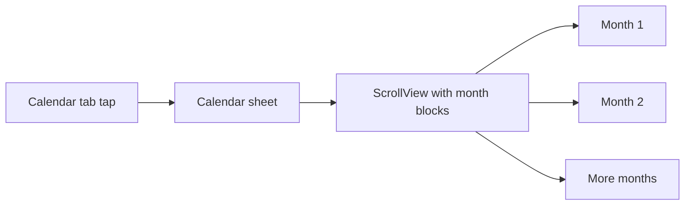

# Calendar tab

## Goal

- **Trigger:** Unchanged – tapping the **Calendar** tab still presents the Calendar **sheet** (Back or swipe down to dismiss).
- **Content:** Replace the placeholder with a **real calendar**: vertically scrollable, showing **1–2 months at a time** as the user scrolls (similar to the iPhone Calendar app). **Display-only** – no tap action on dates for now.
- **Styling:** AuthTheme (black background, white/primary text, secondary for labels, accent if needed). Typography for consistency.

---

## 1. Calendar sheet content

**File: [LinkUp/ContentView.swift](LinkUp/ContentView.swift)** (or a dedicated view file)

- Replace `CalendarPlaceholderView` with a new view that displays the scrollable calendar (e.g. **CalendarSheetView** or **CalendarView**). Keep the same `SheetHost(title: "Calendar") { ... }` wrapper so the sheet title remains "Calendar" and the Back button stays.

**New view (e.g. [LinkUp/Calendar/CalendarView.swift](LinkUp/Calendar/CalendarView.swift) or in ContentView):**

- **Layout:** A **ScrollView** (vertical) containing a stack of **month blocks**. Each month block shows:
  - **Month title** (e.g. "January 2026") – use `DateFormatter` with `month` + `year` from the calendar.
  - **Weekday headers** (e.g. S M T W T F S or Sun–Sat) in secondary style.
  - **Day grid** – 7 columns, rows of dates. Use `Calendar` to get the number of days in the month and the first weekday so dates align correctly. Empty cells before the first day and after the last day so the grid lines up.
- **Range of months:** Generate a range of months to display (e.g. from 12 months ago to 12 months ahead of “today”, or a fixed range). Each month is one block in the scroll.
- **Sizing:** So that **1–2 months** are visible at once, give each month block a sensible height (or use a fixed height per month so scrolling feels like the iOS Calendar app). No need for infinite scroll for this plan – a bounded range is fine.
- **Display-only:** No `onTap` or selection state on day cells. Optional: use a subtle style for “today” (e.g. accent border or dot) so the current date is visible.
- **Dependencies:** Use Swift’s `Calendar`, `DateFormatter`, and `Date`; no new dependencies. AuthTheme for background, text, and borders/lines.

---

## 2. Where the view lives

- **Option A:** New file `LinkUp/Calendar/CalendarView.swift` (and add a Calendar group in the Xcode project if needed). ContentView imports nothing new and references `CalendarView(authState: authState)` or `CalendarView()` inside the sheet.
- **Option B:** Define the calendar view in the same file as ContentView (e.g. replace `CalendarPlaceholderView` with a private `CalendarSheetView` that contains the scroll + month blocks).

Recommendation: **Option A** for clarity and to match the rest of the app structure (Polls, Authentication, etc.).

---

## 3. Flow summary

- User taps Calendar tab → sheet presents with title "Calendar" and Back button.
- Sheet content = scrollable list of months; user scrolls to see 1–2 months at a time. No date tap handling.

---

## 4. Files to add or touch

| File                                                                          | Change                                                                                                                                                                      |
| ----------------------------------------------------------------------------- | --------------------------------------------------------------------------------------------------------------------------------------------------------------------------- |
| [LinkUp/ContentView.swift](LinkUp/ContentView.swift)                          | Replace `CalendarPlaceholderView` in the `.calendar` case with the new calendar view (e.g. `CalendarView()`). Remove or keep `CalendarPlaceholderView` if unused elsewhere. |
| New: [LinkUp/Calendar/CalendarView.swift](LinkUp/Calendar/CalendarView.swift) | ScrollView of month blocks (month title, weekday headers, day grid). Bounded range of months. AuthTheme. Display-only. Optional: highlight today.                           |

---

## 5. Done when

- Tapping the Calendar tab opens the same sheet, but the content is a **scrollable calendar** showing multiple months.
- **1–2 months** are visible at a time as the user scrolls; layout and behavior are similar to the iPhone Calendar app.
- Dates are **display-only** (no tap action). Styling uses AuthTheme and fits the app.

