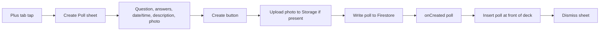

# Create Poll sheet (Plus tab)

## Goal

When the user taps the **Plus** tab, present a **sheet** (instead of the current placeholder) with a form to create a poll. The form includes: **question**, **answer options** (min 2, add more with no strict max), **date/time** for the activity, **description** of the activity, and **optional photo upload** (stored for the future "more details" screen). On submit: save to **Firebase** (Firestore + Storage for photo), then add the new poll to the in-app deck and dismiss the sheet.

---

## 1. Data model and Firebase shape

**Extend [LinkUp/Polls/Poll.swift](LinkUp/Polls/Poll.swift):**

- Add optional activity fields to `Poll`: `activityDate: Date?`, `activityDescription: String?`, `imageURL: String?`.
- Keep `PollOption` as-is (id, text, count; count starts at 0 for new polls).
- Ensure the types can be encoded/decoded for Firestore (e.g. add `Codable` and handle optional `activityDate` as Firestore Timestamp, optional strings for description and imageURL).

**Firestore:** Use a top-level `polls` collection (groups not implemented yet). Document shape:

- `id`, `question`, `options` (array of `{ id, text, count }`), `activityDate` (Timestamp, optional), `activityDescription` (string, optional), `imageURL` (string, optional), `createdBy` (uid), `createdAt` (Timestamp).

**Storage:** Store activity image at `activity_images/{pollId}.jpg` (upload only when user selects a photo). Put the download URL in the poll document as `imageURL`.

---

## 2. Poll creation service

**New file (e.g. [LinkUp/Polls/PollService.swift](LinkUp/Polls/PollService.swift)) or extension on `AuthState`:**

- **Create poll:** Accept question, options (array of option texts), optional date, optional description, optional image data. Generate a new poll ID (e.g. `UUID().uuidString`). If image data provided, upload to `activity_images/{pollId}.jpg` and get download URL; otherwise `imageURL = nil`. Write poll document to `polls/{pollId}` with `createdBy = currentUser.uid`, `createdAt = Date()`. Return the created `Poll` (with options having `count: 0`).
- Use existing `AuthState` refs: `databaseRef`, `storageRef`, and current user uid.

---

## 3. Create Poll UI (sheet content)

**New view: [LinkUp/Polls/CreatePollView.swift](LinkUp/Polls/CreatePollView.swift)**

- **Layout:** Scrollable form (e.g. `ScrollView` + `VStack`) with AuthTheme (background, primary, secondary, accent). Use existing [Input](LinkUp/Authentication/Input.swift) and [Typography](LinkUp/Typography.swift) for consistency.
- **Fields:**
  - **Question:** Single text field (e.g. "What's the activity?").
  - **Answers:** Dynamic list of option text fields. Minimum 2 options; "Add option" button to append more (no strict maximum). Each row: text field + remove button (remove only if count > 2). Option IDs can be generated (e.g. "opt-0", "opt-1", ...) when building the poll.
  - **Date/Time:** Use SwiftUI `DatePicker` (or separate date and time pickers) for the activity date and time. Store as a single `Date` for `activityDate`.
  - **Description:** Multiline text field (e.g. `TextEditor`) for activity description.
  - **Photo:** Optional. Use `PhotosPicker` (PhotosUI) like in [PollsView](LinkUp/Polls/PollsView.swift) (profile image). Show a placeholder (e.g. "Add photo") or thumbnail when selected; load image data only on submit for upload.
- **Actions:** "Create" (or "Create Poll") button. On tap: validate (question non-empty, at least 2 options with non-empty text). Call the poll creation service (upload photo if present, then write Firestore). On success: call `onCreated(newPoll)` and dismiss. Show loading state during submit; optionally show an error message on failure (e.g. alert or inline text).
- **Dependencies:** Pass `authState: AuthState` (for service/refs and current user) and `onCreated: (Poll) -> Void`; use `@Environment(\.dismiss)` to dismiss after success.

---

## 4. Wiring: Plus sheet and poll list ownership

**Lift poll list state to [LinkUp/ContentView.swift](LinkUp/ContentView.swift):**

- Add `@State private var polls: [Poll] = HardcodedPolls.sample` (or load from Firestore on appear later).
- Pass `Binding<[Poll]>` to `PollsView`: e.g. `PollsView(authState:authState, polls: $polls, onOpenSettings: ...)`.
- For the **Plus** sheet, show `CreatePollView(authState: authState, onCreated: { poll in polls.insert(poll, at: 0); presentedSheet = nil })` inside the existing `SheetHost` (title e.g. "Create Poll").

**Update [LinkUp/Polls/PollsView.swift](LinkUp/Polls/PollsView.swift):**

- Replace `@State private var polls` with `@Binding var polls: [Poll]`. Keep all existing deck/swipe logic; it now mutates the binding so the new poll appears at the top of the deck when the sheet dismisses.

---

## 5. Flow summary

- **PollsView** and **PollCardView** do not need to display activity date, description, or image in this plan; those are for the future "more details" screen. The card can continue to show only question and options; the extended model supports the extra fields when you add that screen.

---

## 6. Files to add or touch

| File                                                                   | Change                                                                                                                       |
| ---------------------------------------------------------------------- | ---------------------------------------------------------------------------------------------------------------------------- |
| [LinkUp/Polls/Poll.swift](LinkUp/Polls/Poll.swift)                     | Add `activityDate`, `activityDescription`, `imageURL` to `Poll`; add Firestore encoding/decoding.                            |
| [LinkUp/Polls/PollService.swift](LinkUp/Polls/PollService.swift)       | **New.** Create poll (ID, upload image to Storage, write document to Firestore), return `Poll`.                              |
| [LinkUp/Polls/CreatePollView.swift](LinkUp/Polls/CreatePollView.swift) | **New.** Form view: question, dynamic options, date/time, description, PhotosPicker; submit → service → onCreated + dismiss. |
| [LinkUp/ContentView.swift](LinkUp/ContentView.swift)                   | Own `polls` state; pass `$polls` to PollsView; Plus sheet presents CreatePollView with onCreated that inserts and dismisses. |
| [LinkUp/Polls/PollsView.swift](LinkUp/Polls/PollsView.swift)           | Change `polls` from `@State` to `@Binding var polls`; no other logic change.                                                 |

---

## 7. Done when

- Tapping Plus opens a sheet titled "Create Poll" with the form (question, answers with add/remove, date/time, description, optional photo).
- Submitting a valid form saves the poll to Firestore and, if a photo was chosen, uploads it to Storage and sets `imageURL` on the poll.
- After success, the new poll appears at the top of the deck and the sheet dismisses.
- All UI uses AuthTheme; layout is scrollable and usable on small screens.

