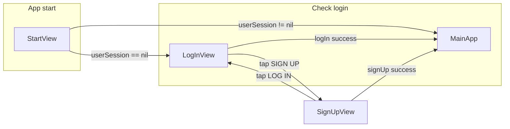

# Plan: Login and Sign Up for LinkUp (iOS app)

This plan mirrors how SONDR_V1 does auth, in simple steps. You can follow it once you have (or create) an Xcode project inside your LinkUp folder.

---

## Where you start

- **LinkUp today:** Firebase is configured (project `linkup-2edb9`), but there is no Xcode app yet—only config files and docs.
- **Step 0 (if needed):** Create a new iOS app in LinkUp (e.g. File → New → Project in Xcode, save inside `/Users/kmaha/Dev/LinkUp`). Name the app and the main target (e.g. "LinkUp"). The rest of the plan assumes you have this app (with at least one SwiftUI view and an `@main` App entry point).

---

## High-level flow (what we're building)

- One shared **AuthState** holds "who is logged in" and talks to Firebase.
- **StartView** shows either the main app or **LogInView**.
- **LogInView** and **SignUpView** call AuthState to log in or sign up; on success, AuthState sets the session and the UI switches to the main app.

---

## Step 1 — Add Firebase to the iOS app

- In Xcode: add the Firebase SDK (e.g. via Swift Package Manager): `https://github.com/firebase/firebase-ios-sdk`. Add at least **FirebaseAuth** and **FirebaseFirestore** (and FirebaseStorage if you'll store profile images later).
- Download **GoogleService-Info.plist** from the Firebase Console for project `linkup-2edb9` and add it to the app target so the app can connect to your Firebase project.
- In your `@main` App struct (e.g. `LinkUpApp.swift`), call `FirebaseApp.configure()` in `init()` so Firebase is set up on launch.

**Why:** The app must be able to call Firebase Auth and Firestore; this step does that.

---

## Step 2 — Create the "auth brain" (AuthState) and user model

- **AuthModel** (simple struct): Holds the user data you care about in the app: e.g. `id`, `email`, `username` (and anything else you need). Make it `Codable` so you can save/load it from Firestore. Same idea as [SONDR_V1 AuthModel](Users/kmaha/Dev/SONDR_V1/Prod1/Authentication/AuthModel.swift).
- **AuthState** (observable class): One object for the whole app that:
  - Keeps references to Firebase Auth, Firestore (and Storage if needed).
  - Has `@Published var userSession: User?` (Firebase user when logged in) and `@Published var currentUser: AuthModel?` (your profile from Firestore).
  - Has `@Published` flags for errors (e.g. `logInError`, `signUpError`, `usernameExists`) so the UI can show alerts.
- Create this class in the app (e.g. `AuthState.swift`) and pass it down (e.g. as `@StateObject` in the root view and `@ObservedObject` in login/sign up screens). SONDR does this in [AuthState.swift](Users/kmaha/Dev/SONDR_V1/Prod1/AuthState.swift) (only the auth-related parts; you can keep yours focused on auth first).

**Why:** All login/sign up logic and "am I logged in?" live in one place; the UI only reads and calls this object.

---

## Step 3 — Implement sign up and log in (AuthViewModel / AuthState extension)

- **Sign up:**  
  - Check if the chosen username is already in Firestore (e.g. query `users` where `AuthenticationData.username == username`). If yes, set `usernameExists` and return.  
  - Call Firebase Auth `createUser(withEmail:password:)`. If it fails (e.g. email in use), set `signUpError` and return.  
  - Create a Firestore document at `users/<uid>` with at least: `AuthenticationData` (encoded AuthModel: id, email, username). You can add more sections later (e.g. Analytics, Progress like SONDR).  
  - Set `userSession = result.user`, then load the new user's data (e.g. call the same "listen for user" logic you use after login) so the UI switches to the main app.
- **Log in:**  
  - Call Firebase Auth `signIn(withEmail:password:)`. On success, set `userSession = result.user`, then load this user's data from Firestore (and start any listeners). On failure, set `logInError` so the UI can show "User doesn't exist" or similar.
- Put these in an extension on AuthState (like [AuthViewModel in SONDR](Users/kmaha/Dev/SONDR_V1/Prod1/Authentication/AuthViewModel.swift)) so the "auth brain" owns both state and actions.

**Why:** This is the actual "create account" and "sign in" behavior; the screens only call these methods and react to the published state.

---

## Step 4 — "Listen for user" and show main app when logged in

- After a successful login or sign up, you need to fill `currentUser` and any other app data from Firestore. Add a method like `listenForUser()` that:
  - Uses `Auth.auth().currentUser?.uid`; if nil, return.
  - Reads (and optionally listens to) the document `users/<uid>`.
  - Decodes `AuthenticationData` into `AuthModel` and sets `currentUser`.
  - You can add more fields/listeners later (habits, tasks, etc.).
- In the root of your app (e.g. the view that decides what to show first), use **StartView**-style logic: if `authState.userSession != nil` show your main app view; else show **LogInView**. Pass `authState` into both so they use the same "auth brain". Same idea as [StartView in SONDR](Users/kmaha/Dev/SONDR_V1/Prod1/Lobby/StartView.swift).

**Why:** The app automatically shows the main screen when someone is logged in and stays in sync with Firestore.

---

## Step 5 — Build the login and sign up screens (UI)

- **Reusable input:** A small `Input` view that takes a binding to text, a title, placeholder, and whether it's a secure field (password). Use it for email, password, and (on sign up) username. Same idea as [Input.swift in SONDR](Users/kmaha/Dev/SONDR_V1/Prod1/Authentication/Input.swift).
- **LogInView:**  
  - State: `email`, `password` (and maybe a toggle for "show password").  
  - UI: logo/title, email field, password field, "LOG IN" button, and a link/button that navigates to SignUpView.  
  - On "LOG IN" tap: call `authState.logIn(withEmail: password:)` (e.g. in a `Task { try await ... }`).  
  - Use `authState.logInError` to show an alert (e.g. "User doesn't exist / Try again").
- **SignUpView:**  
  - State: `username`, `email`, `password`.  
  - UI: logo/title, username, email, password, "SIGN UP" button, and a link back to LogInView.  
  - On "SIGN UP" tap: call `authState.signUp(withEmail: password: username:)`.  
  - Use `authState.signUpError` and `authState.usernameExists` to show alerts ("Email already exists", "Username is taken").
- Use **NavigationLink** (or programmatic navigation) so LogInView can go to SignUpView and SignUpView can go back to LogInView. Pass the same `authState` into both views.

**Why:** Users need a simple way to enter credentials and see errors; this matches the SONDR pattern you already know.

---

## Step 6 — Firestore structure and security

- **Data:** One document per user at `users/<uid>`. At minimum, a map like `AuthenticationData` containing the AuthModel (id, email, username). You can add more keys later (e.g. Analytics, Progress).
- **Security (Firestore rules):**  
  - Only the signed-in user can read/write their own `users/<uid>` document (e.g. `allow read, write: if request.auth != null && request.auth.uid == userId`).  
  - Update [LinkUp firestore.rules](firestore.rules) accordingly and deploy (e.g. `firebase deploy --only firestore:rules`).

**Why:** So user data is stored correctly and only the owner can access it.

---

## Step 7 — Enable Auth and (optional) username uniqueness in Firestore

- In Firebase Console: enable **Email/Password** under Authentication → Sign-in method.
- Username uniqueness is enforced in your app (Step 3) by querying Firestore before creating the account; you can add a Firestore composite index on `users` for `AuthenticationData.username` if you query by it.

**Why:** Firebase Auth can then create and sign in users; your app enforces unique usernames.

---

## Order of work (summary)

| Step | What you do                                                                  |
| ---- | ---------------------------------------------------------------------------- |
| 0    | Create Xcode project in LinkUp (if you don't have one yet).                  |
| 1    | Add Firebase SDK + GoogleService-Info.plist, call `FirebaseApp.configure()`. |
| 2    | Add AuthModel and AuthState (with userSession, currentUser, error flags).    |
| 3    | Implement signUp and logIn (and username check) in AuthState.                |
| 4    | Implement listenForUser and StartView (show login vs main app).              |
| 5    | Build Input, LogInView, SignUpView and wire them to AuthState.               |
| 6    | Define Firestore user document shape and update firestore.rules.             |
| 7    | Enable Email/Password in Firebase Console.                                   |

---

## Simple mental model

- **AuthState** = the single "auth brain": "Is someone logged in? Who? Do sign in / sign up."
- **LogInView / SignUpView** = only collect email/password (and username for sign up) and call AuthState; they don't talk to Firebase directly.
- **StartView** = "If AuthState has a userSession, show main app; else show LogInView."
- **Firebase** = creates the account and stores the user profile in Firestore; AuthState reads that and keeps the app in sync.

If you want, next we can turn this into a concrete task list (e.g. "create AuthState.swift", "add LogInView") or adjust it for a specific main screen you have in mind.
