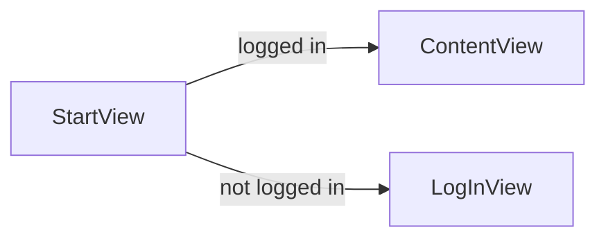

# Main app shell: 3-tab TabView

## Goal

Replace [LinkUp/ContentView.swift](LinkUp/ContentView.swift) with a **TabView** that shows three tabs when the user is logged in:

1. **Messages** — placeholder for the messages/chat list (design: first tab in the design image).
2. **Plus** — placeholder for creating new content (e.g. new poll or event).
3. **Calendar** — placeholder for the calendar view.

Tab bar must use **AuthTheme** (black background, white/secondary labels, accent for selected tab) per [.cursor/rules/app-theme-colors.mdc](.cursor/rules/app-theme-colors.mdc).

## Current flow

After this change, `ContentView` becomes the **main app shell**: a `TabView` with three tab items; each tab shows a placeholder view until those screens are built.

## Implementation

### 1. ContentView as TabView

- In [ContentView.swift](LinkUp/ContentView.swift), replace the current body with a `TabView` with three `Tab` entries.
- Pass `authState` into the shell so each tab view can receive it (e.g. for future logout or user-specific content).
- Use SF Symbols for icons:
  - Messages: `message.fill` (or `bubble.left.and.bubble.right.fill`)
  - Plus: `plus.circle.fill`
  - Calendar: `calendar`
- Set tab labels: "Messages", "Plus", "Calendar" (or "Create" if you prefer).

### 2. Tab bar appearance (AuthTheme)

- Use `toolbarColorScheme(.dark)` and a black/dark background so the tab bar matches the app theme.
- Selected tab: use `AuthTheme.accent` (e.g. via `tint(AuthTheme.accent)` on the TabView or by configuring the selection indicator).
- Unselected tabs and labels: `AuthTheme.secondary` or `AuthTheme.primary` so they contrast on black.

### 3. Placeholder tab views

- **Option A (minimal):** Define three small placeholder views inline in ContentView (e.g. a `Text("Messages")`, `Text("Plus")`, `Text("Calendar")` each with `AuthTheme.background` and `AuthTheme.primary`), so everything stays in one file.
- **Option B (cleaner):** Add three view files under a `Main` or `Tabs` folder (e.g. `MessagesTabView.swift`, `PlusTabView.swift`, `CalendarTabView.swift`), each taking `authState` and showing a simple centered label and background; ContentView then composes the TabView from these three views.

Recommendation: **Option A** for this plan so the scope is “one file change + theme”; tab content can be split into separate views when you build out each screen.

### 4. Responsive / keyboard

- No `GeometryReader` or `ScrollView` required for the shell itself; tab content is placeholders. When you later add real Messages/Plus/Calendar screens, apply the responsive design pattern from [.cursor/plans/linkup_responsive_design_3dc508ce.plan.md](.cursor/plans/linkup_responsive_design_3dc508ce.plan.md) to those views.
- No `.keyboardResponsive()` on the TabView unless a tab contains text fields; add it later per tab if needed.

## Files to touch

| File                                                 | Change                                                                                                                                                                           |
| ---------------------------------------------------- | -------------------------------------------------------------------------------------------------------------------------------------------------------------------------------- |
| [LinkUp/ContentView.swift](LinkUp/ContentView.swift) | Replace body with TabView; add 3 tabs with icons and labels; apply AuthTheme to container and tab bar; add three placeholder views (inline or as separate structs in same file). |

No new files required if using Option A. No changes to [StartView.swift](LinkUp/StartView.swift), [AuthTheme.swift](LinkUp/Authentication/AuthTheme.swift), or navigation flow.

## Done when

- Logging in lands on a tab bar with three tabs: Messages, Plus, Calendar.
- Selecting a tab shows the corresponding placeholder content.
- Tab bar and content use AuthTheme (black, white, cyan accent); no system grey or mockup colors.
- App compiles and runs; no regressions to auth flow.

