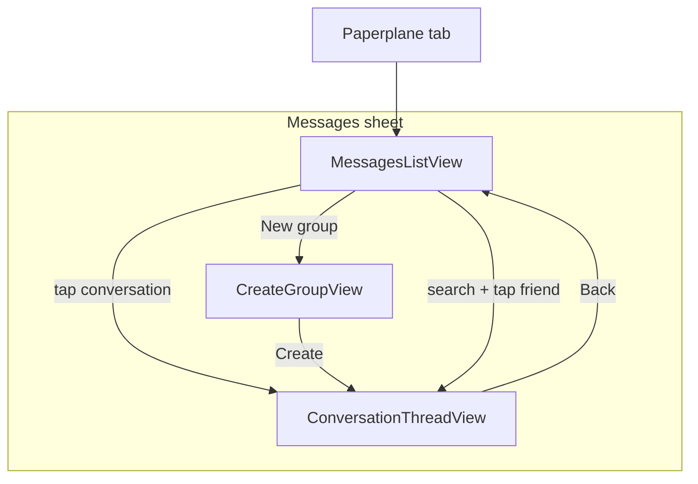

# Messages sheet

## Current state

- **Entry point**: [LinkUp/ContentView.swift](LinkUp/ContentView.swift) — bottom bar "Messages" (paperplane.fill) sets `presentedSheet = .messages`; sheet content is `SheetHost(title: "Messages") { MessagesPlaceholderView(authState:) }`. SheetHost already provides "< Back", inline title, AuthTheme.
- **Friends**: [LinkUp/Friends/](LinkUp/Friends/) — FriendsService (fetch friends, search usernames), Friend/PublicUser models, `users/<uid>/friends/<friendUid>` in Firestore. No messages or conversations yet.
- **Firestore**: [firestore.rules](firestore.rules) — users, friends, friend_requests, polls. No conversation or message collections.

## Target behaviour

- **When the user taps the paperplane tab**: Same sheet opens; content is the new Messages experience (no change to how the sheet is presented).
- **Messages sheet** (main view):
  - **List** of all conversations the user is in: DMs (1:1) and named group chats, ordered by last message time (most recent first). Each row: avatar(s), title (friend username or group name), last message preview and time.
  - **Search**: One search bar that can filter (1) friends to start/open a DM, (2) group chats to open. Tapping a friend opens or creates the DM; tapping a group opens that thread.
  - **Create group chat**: Button or entry point to create a new group — user enters a **group name**, then selects **friends** to add; conversation is created with type group and that name.
  - **Real-time**: Conversation list and open thread use Firestore **listeners** so new messages and updates appear live.
- **Thread view** (DM or group): Message bubbles (sender, text, time), text input to send. Real-time listener on messages. AuthTheme throughout.
- **DMs**: Exactly two participants; no separate "name" (display as the other user’s username). Creating a DM: ensure at most one conversation exists per pair (e.g. query by participantIds containing both, or use deterministic id from sorted uids).

## Data model and security

**1. Conversations (top-level)**

- **Path**: `conversations/<conversationId>`
- **Fields**: `type` ("dm" | "group"), `name` (string, optional for DM), `participantIds` (array of uid), `createdBy` (uid), `createdAt` (timestamp), `lastMessageText` (string, optional), `lastMessageAt` (timestamp, optional). Optional: `participantSummary` (map uid -> { username, profileImageURL }) for list display without extra reads.
- **IDs**: For DM use a deterministic id (e.g. sorted uids joined: `uid1_uid2` so both users see the same doc). For groups use auto-id.
- **Rules**: Read/write if `request.auth.uid` is in `participantIds`. Create if `request.auth != null` and creator is in `participantIds`.

**2. Messages (subcollection)**

- **Path**: `conversations/<conversationId>/messages/<messageId>`
- **Fields**: `senderUid`, `senderUsername` (optional, denormalized), `text`, `createdAt` (timestamp).
- **Rules**: Read/write if request.auth.uid is in the parent conversation’s `participantIds` (need get() in rules).

**3. Indexes**

- Composite index on `conversations`: `participantIds` (array-contains), `lastMessageAt` (desc) for "my conversations" query.
- Composite index on `conversations/<id>/messages`: `createdAt` (asc) for thread ordering.

**4. Real-time**

- List: `addSnapshotListener` on query `conversations` where `participantIds` array-contains `myUid`, orderBy `lastMessageAt` desc.
- Thread: `addSnapshotListener` on `conversations/<id>/messages` orderBy `createdAt` asc.

## UI structure (AuthTheme)

- **Messages list view** (replaces MessagesPlaceholderView): Search bar at top; "New group" button or row; then scrollable list of conversation rows (avatar, title, last preview, time). Tapping a row pushes or presents the thread view.
- **Thread view**: Navigation title = other user’s name (DM) or group name; list of message bubbles (left/right or distinct style by sender); text field + send at bottom. "< Back" returns to list (SheetHost’s back dismisses the sheet — so thread might be a pushed view inside the same NavigationStack, or a nested sheet; prefer pushed so Back goes to list, then sheet Back dismisses).
- **Create group flow**: Modal or pushed view: text field for group name, then list of friends with checkmarks; "Create" creates the conversation and opens the thread.
- Reuse **UserRowView**-style avatar + label where it fits (e.g. friend picker for new group). Use small avatars for conversation list (single for DM, stacked or first member for group).

## Implementation order

1. **Firestore**: Add `conversations` and `conversations/{id}/messages` rules; add composite indexes for participantIds + lastMessageAt and messages createdAt.
2. **Models**: Swift types for Conversation (id, type, name?, participantIds, createdBy, createdAt, lastMessageText?, lastMessageAt?, optional participantSummary) and Message (id, senderUid, text, createdAt).
3. **Messages service**: Create conversation (DM or group), send message (and update conversation’s lastMessageText/lastMessageAt), listener for my conversations, listener for messages in a conversation. Helper: get or create DM between myUid and friendUid (query or deterministic id).
4. **Messages list view**: Replace placeholder; search bar; "New group" entry; conversation list with real-time listener; tap opens thread. Pass authState and dismiss/sheet context as needed.
5. **Thread view**: Message list (listener), text input, send; title from conversation (other user or group name). Back to list.
6. **Create group view**: Name field, friend picker (fetch friends, multi-select), create conversation then navigate to thread.
7. **ContentView**: Swap in the new messages root view inside the existing Messages sheet; ensure navigation (list <-> thread, create group) works inside SheetHost (e.g. NavigationStack inside sheet with list as root and thread/create as pushed destinations).

## Files to add or touch

| Area      | Files                                                                                                                                                                                                                                                                                                             |
| --------- | ----------------------------------------------------------------------------------------------------------------------------------------------------------------------------------------------------------------------------------------------------------------------------------------------------------------- |
| Firestore | [firestore.rules](firestore.rules) — conversations + messages rules; [firestore.indexes.json](firestore.indexes.json) — indexes above                                                                                                                                                                             |
| Models    | New: e.g. `LinkUp/Messages/ConversationModels.swift` (Conversation, Message)                                                                                                                                                                                                                                      |
| Service   | New: `LinkUp/Messages/MessagesService.swift` (create conv, send message, listeners)                                                                                                                                                                                                                               |
| UI        | New: `LinkUp/Messages/MessagesListView.swift` (list + search + new group), `LinkUp/Messages/ConversationThreadView.swift` (thread + input), `LinkUp/Messages/CreateGroupView.swift` (name + friend picker); [ContentView.swift](LinkUp/ContentView.swift) — replace MessagesPlaceholderView with MessagesListView |
| Xcode     | Add new Swift files and Messages group to target                                                                                                                                                                                                                                                                  |

## Flow summary

- **DM**: User searches friend or taps from list → get-or-create DM conversation → open thread. Send message updates conversation’s lastMessage* and adds to messages subcollection.
- **Group**: User taps "New group" → name + pick friends → create conversation (type=group, name, participantIds) → open thread. Same message send path.
- **Real-time**: List and thread both use snapshot listeners so new messages and new conversations appear live.

No emojis; AuthTheme only; layout and copy can follow your design.