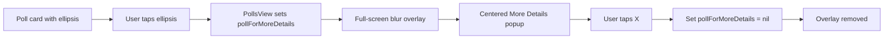

# More Details popup

## Goal

- **Trigger:** A **vertical ellipsis** (⋮) in the **top right corner** of each poll card. When tapped, the **More Details popup** appears.
- **Presentation:** Popup is **centered** on screen; the rest of the UI is **slightly blurred**. An **X** in the top right of the popup dismisses it.
- **Popup content:** Poll **question**, **date and time** of the activity, **optional image** (from Create Poll), and **description**. All use **AuthTheme** (black background, white/secondary text, accent where needed).

Data is already on the model: [LinkUp/Polls/Poll.swift](LinkUp/Polls/Poll.swift) has `activityDate`, `activityDescription`, and `imageURL`.

---

## 1. Ellipsis on the card

**File: [LinkUp/Polls/PollCardView.swift](LinkUp/Polls/PollCardView.swift)**

- Add a **callback** so the card can tell the parent to show more details: e.g. `var onShowMoreDetails: (() -> Void)?` (optional so previews and non-interactive uses still work).
- In the card body, add an **overlay** (e.g. `.overlay(alignment: .topTrailing)`) that places a **Button** with SF Symbol `ellipsis` (vertical) in the top-right corner, with padding so it sits just inside the card. Use `AuthTheme.secondary` or `AuthTheme.primary` for the icon.
- On tap, call `onShowMoreDetails?()`.
- Ensure the button doesn’t steal taps from the swipe gesture (ellipsis is a small hit target in the corner; the rest of the card remains swipeable).

---

## 2. Who owns “which poll’s details are showing”

**File: [LinkUp/Polls/PollsView.swift](LinkUp/Polls/PollsView.swift)**

- Add state to represent the poll whose details are shown: e.g. `@State private var pollForMoreDetails: Poll?`. When non-nil, the More Details popup is presented.
- When building the **top** (front) card only, pass a closure that sets `pollForMoreDetails = polls[0]` (or the current top poll). So: `PollCardView(poll: $polls[0], onShowMoreDetails: { pollForMoreDetails = polls[0] })`. The cards in the back don’t need the callback (they’re not tappable per existing `allowsHitTesting(false)`), so you can pass `nil` or omit the parameter for those if the API allows.

---

## 3. Blurred background + centered popup

**File: [LinkUp/Polls/PollsView.swift](LinkUp/Polls/PollsView.swift)**

- When `pollForMoreDetails != nil`, overlay the entire PollsView content with a **full-screen** layer:
  - A **dimmed + blurred** background (e.g. `Color.black.opacity(0.5)` and `.background(.ultraThinMaterial)` or a blur modifier) so “everything else in the background blurs out a little.”
  - A **centered** card (rounded rectangle, AuthTheme background/border) containing the More Details content.
- Tapping the **X** sets `pollForMoreDetails = nil` and dismisses the overlay. Optionally, tapping the dimmed background (outside the card) can also set `pollForMoreDetails = nil` for better UX; the plan assumes X is required and tap-outside is optional.

Implementation approach: in the main body `ZStack`, add a conditional overlay (e.g. `if let poll = pollForMoreDetails { ... }`) that covers the full frame, shows the blur/dim, then a `VStack` or similar for the popup card centered in the middle. Use `ZStack(alignment: .center)` so the popup stays centered on different devices.

---

## 4. More Details popup content

**New view (e.g. in same file as PollsView or a small dedicated file): `MoreDetailsPopupView` or equivalent.**

- **Input:** One `Poll` (the one to display); and a **close action** (e.g. `onClose: () -> Void`).
- **Layout (top to bottom):**
  - **Top bar:** Title row with **question** and **date/time** (e.g. “Movies – 5pm” and “06/11/2026” on a second line or subtitle). Format `activityDate` with `DateFormatter` (time style .short, date style .short or custom “dd/MM/yyyy”). If `activityDate` is nil, show a placeholder like “No date set” or hide the date line. **X button** in the top-right of the popup; call `onClose` on tap.
  - **Optional image:** If `poll.imageURL` is non-nil, show an **AsyncImage** (or equivalent) loading from that URL, with a sensible max height and aspect ratio (e.g. cap height, aspect fit), rounded corners to match the card. If nil, omit the image section.
  - **Description:** If `activityDescription` is non-empty, show it in a scrollable **Text** (or `TextEditor` read-only). If empty, show placeholder text like “No description” in secondary color or omit.
- **Styling:** AuthTheme throughout (background, primary, secondary, accent for the X or key actions). Use [Typography](LinkUp/Typography.swift) and existing patterns from [PollCardView](LinkUp/Polls/PollCardView.swift) / [CreatePollView](LinkUp/Polls/CreatePollView.swift) for consistency.

---

## 5. Flow summary

---

## 6. Files to add or touch

| File                                                               | Change                                                                                                                                                                                 |
| ------------------------------------------------------------------ | -------------------------------------------------------------------------------------------------------------------------------------------------------------------------------------- |
| [LinkUp/Polls/PollCardView.swift](LinkUp/Polls/PollCardView.swift) | Add optional `onShowMoreDetails`; overlay top-trailing ellipsis button that calls it.                                                                                                  |
| [LinkUp/Polls/PollsView.swift](LinkUp/Polls/PollsView.swift)       | Add `pollForMoreDetails: Poll?` state; pass `onShowMoreDetails` to top card; when non-nil, show full-screen blur overlay and centered More Details content (inline or extracted view). |
| New or inline view                                                 | More Details content: question, formatted date/time, X button, optional image (AsyncImage), description. AuthTheme and Typography.                                                     |

---

## 7. Done when

- Each (top) poll card shows a vertical ellipsis in the top-right corner.
- Tapping the ellipsis opens a centered More Details popup with the rest of the screen blurred/dimmed.
- Popup shows: question, date/time, X to close, optional image (if present), description.
- Tapping X closes the popup; layout and styling use AuthTheme and work on small screens (scroll description if needed).

