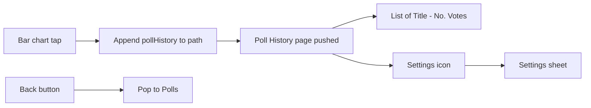

# Poll History page

## Goal

- **Entry:** Tapping the **bar chart icon** in the top-right of the Polls header opens a new **page** titled **"History"** (its own screen, not a sheet).
- **Navigation:** The History page is a **pushed view** in the same `NavigationStack` as the Polls root—so the user gets a standard **Back** button to return to the poll deck.
- **History page:** Title "History". A **vertical list** of all polls. Each row: **bar chart icon** (left, tappable placeholder) and text **"Title - No. Votes"** (e.g. "Climbing? - 10 votes"). **Top right:** a **settings icon** that opens the **Settings** page (e.g. as a sheet presented from this page).
- **Styling:** AuthTheme and Typography.

---

## 1. Navigation: bar chart pushes Poll History (not a sheet)

**File: [LinkUp/ContentView.swift](LinkUp/ContentView.swift)**

- Keep the existing `NavigationStack` that wraps `PollsView` and the bottom bar.
- Introduce a **navigation path** so we can push a screen: e.g. `@State private var navigationPath: [Route] = []` with an enum `enum Route: Hashable { case pollHistory }`.
- Use `**NavigationStack(path: $navigationPath)`** (or the iOS 16+ initializer with a path binding) and add `**.navigationDestination(for: Route.self)`** that, when the route is `.pollHistory`, presents `**PollHistoryView(authState: authState, polls: polls)`**. So when `navigationPath` contains `.pollHistory`, that view is pushed on top of PollsView.
- Pass to **PollsView** a callback that appends to the path: e.g. `onOpenPollHistory: { navigationPath.append(.pollHistory) }`. No new sheet type for Poll History; remove any `AppSheet.pollHistory` if it was in the plan before.

**File: [LinkUp/Polls/PollsView.swift](LinkUp/Polls/PollsView.swift)**

- Add `**var onOpenPollHistory: () -> Void`**.
- In the header, the **bar chart** `Button` action calls `**onOpenPollHistory()`**, so tapping it pushes the Poll History page.

Result: Bar chart tap → path becomes `[.pollHistory]` → Poll History is pushed as its own page with a Back button provided by the navigation bar.

---

## 2. Poll History page: list and toolbar

**New file: [LinkUp/Polls/PollHistoryView.swift](LinkUp/Polls/PollHistoryView.swift)**

- **Inputs:** `authState: AuthState`, `polls: [Poll]`.
- **Toolbar:** Set **navigation title to "History"**. The **trailing** item is a **settings** icon that presents **Settings** (e.g. `@State private var showSettings = false` and `.sheet(isPresented: $showSettings) { ... SheetHost("Settings") { SettingsView(authState: authState) } }`). So from this page, the user can open Settings in a sheet; dismissing it returns to Poll History. The **leading** Back button is provided by the system (pop from the navigation stack when the user taps Back).
- **Body:** A **List** or **ScrollView** with a row per poll. Each row:
  - **Left:** **Bar chart icon** (`chart.bar.fill`) as a `Button` (action empty or placeholder for future “view detail”).
  - **Text:** **"poll.question) - poll.totalVoteCount) votes"** (e.g. "Climbing? - 10 votes").
- **Empty state:** If `polls.isEmpty`, show a message (e.g. "No polls yet") in AuthTheme.secondary.
- **Styling:** AuthTheme background, primary/secondary text, Typography. Match existing list/row patterns in the app.

---

## 3. Flow summary

---

## 4. Files to add or touch

| File                                                                     | Change                                                                                                                                                                                                                                                                                   |
| ------------------------------------------------------------------------ | ---------------------------------------------------------------------------------------------------------------------------------------------------------------------------------------------------------------------------------------------------------------------------------------- |
| [LinkUp/ContentView.swift](LinkUp/ContentView.swift)                     | Use `NavigationStack(path: $navigationPath)` with a `Route` enum (e.g. `case pollHistory`). Add `.navigationDestination(for: Route.self)` showing `PollHistoryView(authState: authState, polls: polls)`. Pass `onOpenPollHistory: { navigationPath.append(.pollHistory) }` to PollsView. |
| [LinkUp/Polls/PollsView.swift](LinkUp/Polls/PollsView.swift)             | Add `onOpenPollHistory: () -> Void`; bar chart button calls it.                                                                                                                                                                                                                          |
| [LinkUp/Polls/PollHistoryView.swift](LinkUp/Polls/PollHistoryView.swift) | **New.** Page with list (bar icon + "Title - N votes" per row), trailing settings icon that presents Settings sheet, AuthTheme.                                                                                                                                                          |

---

## 5. Done when

- Tapping the bar chart icon in the Polls header **pushes** the **History** page (no sheet).
- The History page shows a vertical list of all polls as "Question - N votes" with a bar chart icon on the left of each row (tappable placeholder).
- Top right of the Poll History page has a settings icon that opens Settings (e.g. in a sheet); Back from navigation bar returns to the poll deck.
- Styling uses AuthTheme and fits the rest of the app.

