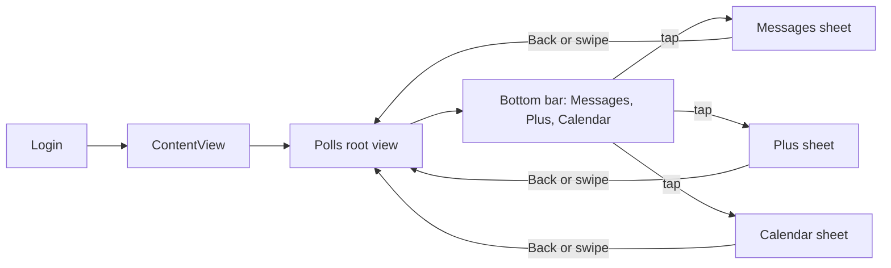

# Poll page: default landing, view/vote only (hardcoded)

## Goal

- **Default after login:** The first screen the user sees after logging in or signing up is the **poll page** (not the current Plus tab).
- **Navigation:** Polls is the **root view** (no Polls tab). A bottom bar shows Messages, Plus, and Calendar. Tapping one opens that screen as a **sheet**; the user returns to the Polls page via a **Back** button (top left) or **swipe down** to dismiss the sheet.
- **Scope:** View and vote only: a vertical list of poll cards; each card shows question, vote count, options (e.g. Yes/No), and lets the user select an option and see percentages. No create/edit/delete, no History or Friends' votes.
- **Data:** Polls are intended to be **group-scoped** (polls created by members of groups the user is in). Friends/groups are not built yet, so **use hardcoded poll data** for this plan. The plan will specify the future Firestore structure and that the UI will later be fed by real group membership and `groups/{gid}/polls`.

---

## 1. Navigation: Poll page as root (no Polls tab)

- **Current:** [LinkUp/ContentView.swift](LinkUp/ContentView.swift) shows the main app when logged in.
- **Change:**
  - **Polls is the root view** — the first screen after login is `PollsView()` inside a `NavigationStack`. There is **no Polls tab** in the bottom bar.
  - **Bottom bar** has three items only: Messages, Plus, Calendar (custom bar, not a `TabView`). Tapping one presents that screen as a **sheet**.
  - **Sheets:** Messages, Plus, and Calendar are presented via `.sheet(item:)`. Each sheet has a **Back** button (top left, accent style) and is **swipe-to-dismiss** (default sheet behavior). Dismissing returns the user to the Polls page.
  - The bottom bar is implemented with `.safeAreaInset(edge: .bottom)` so the poll list scrolls above it and the bar clears the home indicator.

---

## 2. Data model (in-app only; hardcoded for now)

- **Poll:** `id`, `question`, `options` (e.g. list of `PollOption`), `totalVoteCount`, and either per-option counts or a list of `Response` for computing counts. Keep it simple: e.g. `PollOption(id, text, count)` and derive total from sum of counts.
- **Response (optional for later):** For a real backend you'd have `userId`, `pollId`, `selectedOptionId`; not required for hardcoded vote UI if we only display counts and allow "voting" in memory for MVP.
- **Where it lives:** New types in the app (e.g. `Poll`, `PollOption`); no Firestore reads/writes in this plan. Use a **hardcoded list** of 2–3 polls (e.g. "Climbing?" with 10 votes, Yes/No 50/50; one or two more) so the ScrollView has content. Optionally, allow "voting" to update local state only (so counts/percents change in UI).
- **Future:** Document that real data will come from **groups**: e.g. `groups/{groupId}/polls` with security so only group members can read/write; the list of polls on this page will be "all polls from groups the current user is in." Friends/groups features are out of scope for this plan.

---

## 3. Poll page UI (view/vote only)

- **Layout (follow [LinkUp Design.png](LinkUp Design.png) structure, apply [AuthTheme](LinkUp/Authentication/AuthTheme.swift)):**
  - Top bar: simple title (e.g. "Polls" or "Me" if you want to match design); optional settings/more icons later.
  - Body: **vertical ScrollView** of poll cards.
- **Each poll card:**
  - Poll question (e.g. "Climbing?").
  - Total vote count (e.g. "10 votes").
  - Options as selectable controls (e.g. Yes/No as a segmented control or two buttons). Use **AuthTheme.accent** for selected option.
  - Show percentage per option (e.g. 50% / 50%).
- **Theme:** Background `AuthTheme.background`, text `AuthTheme.primary` / `AuthTheme.secondary`, accent for selection and key actions per [.cursor/rules/app-theme-colors.mdc](.cursor/rules/app-theme-colors.mdc). Ignore mockup colours.
- **Responsive:** Apply the pattern from [.cursor/plans/responsive-design.plan.md](.cursor/plans/responsive-design.plan.md): `GeometryReader` at root, proportional padding/spacing, `ScrollView` for the list. No `.keyboardResponsive()` needed for view/vote-only (no text fields).

---

## 4. Files and responsibilities

| Area               | Action                                                                                                                                                                                                    |
| ------------------ | --------------------------------------------------------------------------------------------------------------------------------------------------------------------------------------------------------- |
| **ContentView**    | Make Polls the root view (NavigationStack with PollsView). No Polls tab. Custom bottom bar (Messages, Plus, Calendar) that presents each as a sheet; use SheetHost with Back button and swipe-to-dismiss. |
| **Poll models**    | New file(s) or section: `Poll`, `PollOption` (and optional `Response`) as Swift types.                                                                                                                    |
| **Poll page view** | New view: scrollable list of poll cards; each card shows question, count, options, selection state, percentages. Feed from a hardcoded `[Poll]` (e.g. in a simple `PollViewModel` or static list).        |
| **State**          | For hardcoded MVP, voting can update in-memory state only (e.g. increment option count and refresh UI). No persistence required.                                                                          |

Suggested structure:

- `LinkUp/Polls/Poll.swift` (or `Models/Poll.swift`) — types `Poll`, `PollOption`.
- `LinkUp/Polls/PollCardView.swift` — single poll card (question, votes, options, percentages).
- `LinkUp/Polls/PollsView.swift` — main poll page: ScrollView of `PollCardView`s, uses hardcoded data.
- `ContentView`: root = NavigationStack { PollsView() }; bottom bar with Messages/Plus/Calendar that present sheets (SheetHost with Back + swipe down).

---

## 5. Out of scope (for later)

- Create/edit/delete poll, Edit Poll page, description, date/time.
- History (bar chart) and Friends' votes screens.
- Real groups or friends: no Firestore `groups` or membership; no new Firestore rules in this plan.
- Persisting votes to Firestore.

---

## 6. Done when

- After login, the user lands on the **Polls** page (root view; no Polls tab).
- The poll page shows a vertical list of poll cards (hardcoded 2–3 polls).
- Each card shows question, vote count, selectable options (e.g. Yes/No), and percentages; selection uses AuthTheme.
- Bottom bar has Messages, Plus, Calendar only. Tapping one opens that screen as a sheet; Back button (top left) or swipe down returns to the Polls page.
- Layout is responsive (GeometryReader, proportional spacing, ScrollView); theme is AuthTheme throughout.
- App compiles and runs; no regressions to auth flow.
