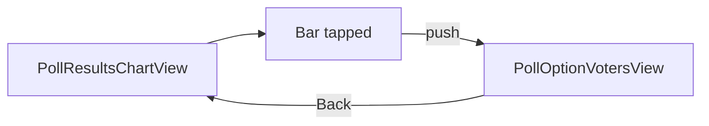
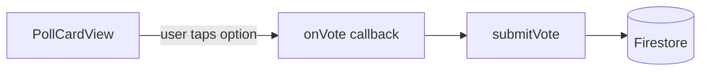

# Poll bar drill-through: who voted

## Goal

- **Persist votes:** When a user votes on a poll (in [LinkUp/Polls/PollCardView.swift](LinkUp/Polls/PollCardView.swift)), save their choice to Firestore so we can show "who voted for which option."
- **Drill-through:** In the poll results chart sheet ([LinkUp/Polls/PollResultsChartView.swift](LinkUp/Polls/PollResultsChartView.swift)), make each bar tappable. Tapping a bar **pushes** a new screen inside the same sheet that lists the usernames of people who voted for that option. Back returns to the chart. Simple, clear hierarchy (modern tech app pattern).

---

## 1. Response storage (Firestore + model)

**Firestore shape**

- **Subcollection:** `polls/{pollId}/responses/{userId}` (one document per user per poll).
- **Document fields:** `optionId: String`, `username: String` (denormalized so we can show names without reading other users’ `users/{uid}` docs; keeps rules simple).
- **When a user votes:** Write/update `polls/{pollId}/responses/{userId}` with `{ optionId, username }`. Update the poll document’s `options[].count` (decrement previous option if any, increment new option). Use a batch or two writes so counts and response stay in sync.

**Security rules** ([firestore.rules](firestore.rules))

- Under `match /polls/{pollId}` add:
  - `match /responses/{userId}`: allow **read** if `request.auth != null` (any signed-in user can see who voted). Allow **create, update** if `request.auth.uid == userId` (users only write their own vote).

**Model**

- Optional: add a small type for a voter row, e.g. `struct PollVoter: Identifiable { let id: String; let username: String }` (id = userId), or use `PublicUser` / a tuple. Plan uses a simple list of usernames (or uid + username) for the drill-through screen.

---

## 2. PollService: submit vote and fetch voters

**File: [LinkUp/Polls/PollService.swift](LinkUp/Polls/PollService.swift)** (extend `AuthState` or add to existing PollService)

- **submitVote(pollId: String, optionId: String, previousOptionId: String?)**  
  - Requires current user (uid + username).  
  - In a batch (or two sequential writes):  
    1. Update poll document: for the option at `previousOptionId` decrement `count` (if present); for the option at `optionId` increment `count`.
    2. Set `polls/{pollId}/responses/{userId}` to `{ optionId, username }`.
  - On success, return the updated poll (or void; caller can refresh poll from Firestore if needed).
- **fetchVoters(pollId: String, optionId: String) async throws -> [PollVoter]**  
  - Query `polls/{pollId}/responses` where `optionId == optionId` (or get all responses and filter client-side if no composite index).  
  - Each document gives `userId` (document ID) and `username`.  
  - Return an array of voter models (e.g. `PollVoter(id: userId, username: username)`).

**Wiring the vote from UI**

- [LinkUp/Polls/PollCardView.swift](LinkUp/Polls/PollCardView.swift) currently only updates the `poll` binding. Add an optional **onVote: ((pollId: String, optionId: String, previousOptionId: String?) -> Void)?**. When the user taps an option (after updating the binding), call `onVote?(poll.id, option.id, previousOptionId)`.
- **PollsView** (or wherever `PollCardView` is used): pass `onVote` that calls `await authState.submitVote(...)`, then refresh that poll from Firestore (or merge the returned poll into `polls`) so the deck and history stay in sync.

---

## 3. Drill-through UI: push "Who voted" inside the chart sheet

**PollResultsChartView**

- The chart is already inside a `NavigationStack`. Add an optional **navigation path or selected-option state** so that when a bar is tapped we push a second screen.
- **Make each bar tappable:** Wrap the bar (or the whole `barUnit`) in a `Button` or `.onTapGesture`. On tap, set state to the selected option (e.g. `selectedOptionForVoters: PollOption?`) and push the voters view. Prefer **NavigationLink** with `value: option` and `.navigationDestination(for: PollOption.self)` (or a simple `NavigationLink(destination: PollOptionVotersView(...))`) so the "Who voted" screen has a Back button automatically.
- Pass **pollId** and **option** (and optionally **authState** for the fetch) into the pushed view. PollResultsChartView already has `poll: Poll`, so it has `poll.id` and `poll.options`.

**New view: PollOptionVotersView** (e.g. in [LinkUp/Polls/PollOptionVotersView.swift](LinkUp/Polls/PollOptionVotersView.swift))

- **Inputs:** `pollId: String`, `option: PollOption`, and a way to fetch voters (e.g. `authState: AuthState` and call `authState.fetchVoters(pollId: pollId, optionId: option.id)` in `.task`).
- **Layout:** Title = option text (e.g. "Yes"); subtitle = "option.count) votes". List of usernames (e.g. `ForEach(voters) { Text($0.username) }`). Empty state: "No one has voted for this option yet" when `voters.isEmpty`. Use **AuthTheme** and **Typography**.
- **Back:** Provided by the navigation stack (no custom Back button needed).

**Flow**

1. User is on Poll Results chart sheet (half height).
2. User taps a bar (e.g. "Yes").
3. Chart sheet pushes **PollOptionVotersView** with title "Yes", "5 votes", and a list of 5 usernames.
4. User taps Back and returns to the chart.

---

## 4. Files to touch

| File                                                                                        | Change                                                                                                                                                                                                              |
| ------------------------------------------------------------------------------------------- | ------------------------------------------------------------------------------------------------------------------------------------------------------------------------------------------------------------------- |
| [firestore.rules](firestore.rules)                                                          | Add `match /polls/{pollId}/responses/{userId}` with read for signed-in, write when `userId == request.auth.uid`.                                                                                                    |
| [LinkUp/Polls/Poll.swift](LinkUp/Polls/Poll.swift)                                          | Optionally add `struct PollVoter` (id, username) for the voters list.                                                                                                                                               |
| [LinkUp/Polls/PollService.swift](LinkUp/Polls/PollService.swift)                            | Add `submitVote(pollId, optionId, previousOptionId)` (update poll counts + response doc); add `fetchVoters(pollId, optionId)` returning `[PollVoter]`.                                                              |
| [LinkUp/Polls/PollCardView.swift](LinkUp/Polls/PollCardView.swift)                          | Add optional `onVote: ((pollId, optionId, previousOptionId) -> Void)?`; call it after updating the binding when user selects an option.                                                                             |
| [LinkUp/Polls/PollsView.swift](LinkUp/Polls/PollsView.swift)                                | Pass `onVote` into `PollCardView` that calls `submitVote` and refreshes/updates the poll in state.                                                                                                                  |
| [LinkUp/Polls/PollResultsChartView.swift](LinkUp/Polls/PollResultsChartView.swift)          | Make each bar tappable; add `NavigationLink` or `navigationDestination` to push `PollOptionVotersView(pollId: poll.id, option: option, authState: authState)` (need to pass `authState` into PollResultsChartView). |
| [LinkUp/Polls/PollHistoryView.swift](LinkUp/Polls/PollHistoryView.swift)                    | Pass `authState` into `PollResultsChartView` so the chart can pass it to the voters view.                                                                                                                           |
| **New:** [LinkUp/Polls/PollOptionVotersView.swift](LinkUp/Polls/PollOptionVotersView.swift) | Screen that fetches and lists usernames for the selected option; AuthTheme; empty state.                                                                                                                            |
| LinkUp.xcodeproj/project.pbxproj                                                            | Add `PollOptionVotersView.swift` to the target.                                                                                                                                                                     |

---

## 5. Order of implementation

1. Firestore rules for `responses` subcollection.
2. `PollVoter` (if new type) and PollService: `submitVote`, `fetchVoters`.
3. PollCardView `onVote` + PollsView wiring so votes persist.
4. PollOptionVotersView (new) + add to project.
5. PollResultsChartView: pass `authState`, make bars tappable, push PollOptionVotersView.
6. PollHistoryView: pass `authState` into PollResultsChartView.

---

## Flow diagram

Vote persistence flow (separate):

