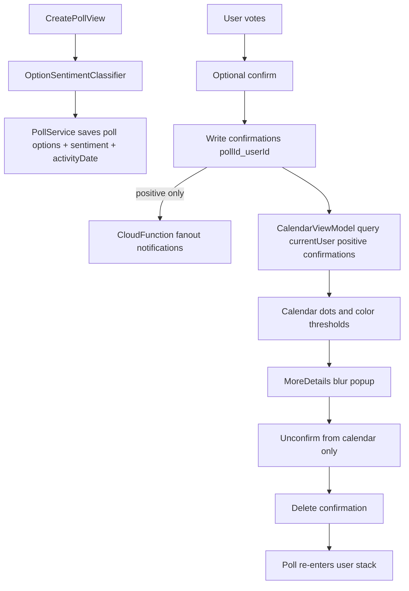

# Poll Confirmation Plan

## Goal

Add optional vote confirmation that drives stack/history behavior, in-app notifications, and calendar entries, with one confirmation per user per poll and safe cleanup behavior.

## Step 1: Data model and sentiment strategy

- **Decide v1 sentiment approach:** implement deterministic client-side classification with a curated positive/negative phrase map and normalization fallback (lowercase, punctuation trim, keyword contains), then store resolved sentiment with each option at poll creation.
- **Why v1:** no network dependency, predictable behavior, low latency, easy to test; later replaceable with API/ML if needed.
- **Files to update:**
  - `[/Users/kmaha/Dev/LinkUp/LinkUp/Polls/Poll.swift](/Users/kmaha/Dev/LinkUp/LinkUp/Polls/Poll.swift)`
  - `[/Users/kmaha/Dev/LinkUp/LinkUp/Polls/PollService.swift](/Users/kmaha/Dev/LinkUp/LinkUp/Polls/PollService.swift)`
  - `[/Users/kmaha/Dev/LinkUp/LinkUp/Polls/CreatePollView.swift](/Users/kmaha/Dev/LinkUp/LinkUp/Polls/CreatePollView.swift)`
  - new helper: `[/Users/kmaha/Dev/LinkUp/LinkUp/Polls/OptionSentimentClassifier.swift](/Users/kmaha/Dev/LinkUp/LinkUp/Polls/OptionSentimentClassifier.swift)`
- **Done when:** poll options persist with explicit sentiment (`positive`/`negative`) and unit tests cover common phrases + ambiguous fallback.

## Step 2: Enforce required activity date during poll creation

- Add UI validation and create-time guard so polls cannot be created without an activity date.
- Ensure error state uses existing app styling conventions with `AuthTheme` colors.
- **Files to update:**
  - `[/Users/kmaha/Dev/LinkUp/LinkUp/Polls/CreatePollView.swift](/Users/kmaha/Dev/LinkUp/LinkUp/Polls/CreatePollView.swift)`
  - `[/Users/kmaha/Dev/LinkUp/LinkUp/Polls/PollService.swift](/Users/kmaha/Dev/LinkUp/LinkUp/Polls/PollService.swift)`
- **Done when:** creation is blocked without date; valid polls save successfully; app builds.

## Step 3: Confirmation persistence and rules

- Add confirmation model with one document per `(pollId, userId)`.
- Store: `selectedOptionId`, `selectedSentiment`, `confirmedAt`, `activityDate`, `pollId`, `userId`.
- Enforce one confirmation per user per poll via deterministic document id (`{pollId}_{userId}`) and transactional writes.
- Update vote flow to lock vote changes while confirmed (unless unconfirmed).
- **Files to update:**
  - `[/Users/kmaha/Dev/LinkUp/LinkUp/Polls/PollService.swift](/Users/kmaha/Dev/LinkUp/LinkUp/Polls/PollService.swift)`
  - `[/Users/kmaha/Dev/LinkUp/LinkUp/Polls/PollViewModel.swift](/Users/kmaha/Dev/LinkUp/LinkUp/Polls/PollViewModel.swift)`
  - `[/Users/kmaha/Dev/LinkUp/LinkUp/Polls/PollCardView.swift](/Users/kmaha/Dev/LinkUp/LinkUp/Polls/PollCardView.swift)`
  - new models: `[/Users/kmaha/Dev/LinkUp/LinkUp/Notifications/Confirmation.swift](/Users/kmaha/Dev/LinkUp/LinkUp/Notifications/Confirmation.swift)`
- **Done when:** confirm writes are idempotent, reconfirm overwrites same doc safely, negative confirms do not create calendar records.

## Step 4: Stack/history behavior for confirm and unconfirm

- On confirm (positive or negative): remove poll from user stack, keep in history.
- On unconfirm (calendar-only entry point): delete/clear confirmation and reinsert poll into stack so user can vote and reconfirm.
- Restrict unconfirm action to calendar details UI only.
- **Files to update:**
  - `[/Users/kmaha/Dev/LinkUp/LinkUp/Calendar/CalendarView.swift](/Users/kmaha/Dev/LinkUp/LinkUp/Calendar/CalendarView.swift)`
  - `[/Users/kmaha/Dev/LinkUp/LinkUp/Calendar/CalendarDetailsView.swift](/Users/kmaha/Dev/LinkUp/LinkUp/Calendar/CalendarDetailsView.swift)`
  - `[/Users/kmaha/Dev/LinkUp/LinkUp/Polls/PollService.swift](/Users/kmaha/Dev/LinkUp/LinkUp/Polls/PollService.swift)`
- **Done when:** unconfirm is only available from calendar details; poll returns to stack; vote can be changed again.

## Step 5: In-app notifications model and delivery

- Create notification document per recipient when a user confirms positive.
- Recipients: all users who have voted in that poll (including creator if voted).
- Notification payload: actor username, poll id/title, action targets (`Confirm too`, `Change vote`).
- Keep confirmations private on poll cards (no visible confirmation list).
- **Recommended backend:** Cloud Function trigger on confirmation writes to create recipient notifications server-side and avoid client trust issues.
- **Files to update:**
  - `[/Users/kmaha/Dev/LinkUp/functions/src/index.ts](/Users/kmaha/Dev/LinkUp/functions/src/index.ts)` (or existing functions entry)
  - `[/Users/kmaha/Dev/LinkUp/LinkUp/Notifications/NotificationService.swift](/Users/kmaha/Dev/LinkUp/LinkUp/Notifications/NotificationService.swift)`
  - `[/Users/kmaha/Dev/LinkUp/LinkUp/Notifications/NotificationsView.swift](/Users/kmaha/Dev/LinkUp/LinkUp/Notifications/NotificationsView.swift)`
- **Done when:** positive confirm emits per-user in-app notifications with action affordances and deep links.

## Step 6: Calendar integration and dot color thresholds

- Calendar data source shows only current user’s positive confirmations by `activityDate`.
- Tapping dot opens existing more-details blur popup for the underlying poll.
- Compute color by `% positive confirmations / total voters`:
  - green: >79%
  - orange: 60–79%
  - red: <60%
- Remove/hide entries when poll deleted or user loses visibility.
- **Files to update:**
  - `[/Users/kmaha/Dev/LinkUp/LinkUp/Calendar/CalendarView.swift](/Users/kmaha/Dev/LinkUp/LinkUp/Calendar/CalendarView.swift)`
  - `[/Users/kmaha/Dev/LinkUp/LinkUp/Calendar/CalendarViewModel.swift](/Users/kmaha/Dev/LinkUp/LinkUp/Calendar/CalendarViewModel.swift)`
  - `[/Users/kmaha/Dev/LinkUp/LinkUp/Polls/PollService.swift](/Users/kmaha/Dev/LinkUp/LinkUp/Polls/PollService.swift)`
- **Done when:** only personal positive confirmations appear; dot color reflects threshold logic; details popup opens correctly.

## Step 7: Firestore rules, cleanup, and edge cases

- Add/update security rules for confirmation ownership, notification reads/writes, and recipient scoping.
- Add cleanup paths:
  - poll deletion cascades confirmations + notifications references
  - visibility loss filters out calendar entries and disallows stale actions
- **Files to update:**
  - `[/Users/kmaha/Dev/LinkUp/firestore.rules](/Users/kmaha/Dev/LinkUp/firestore.rules)`
  - `[/Users/kmaha/Dev/LinkUp/functions/src/index.ts](/Users/kmaha/Dev/LinkUp/functions/src/index.ts)`
- **Done when:** invalid cross-user writes are blocked; stale records are cleaned or safely ignored.

## Step 8: Validation, tests, and build gates

- Add tests for:
  - sentiment classification
  - one-confirmation invariant
  - confirm/unconfirm stack transitions
  - notification recipient fanout logic
  - calendar color thresholds
- Build after each implementable step and fix compile issues immediately.
- Final pass: verify app flow in simulator and ensure no step leaves project unbuildable.
- **Files to update:** existing test targets under `[/Users/kmaha/Dev/LinkUp/LinkUpTests/](/Users/kmaha/Dev/LinkUp/LinkUpTests/)` and function tests if present.
- **Done when:** tests pass (or are documented if unavailable), and project builds successfully in Xcode 15.4.

## Data flow (v1)

## Implementation notes

- Keep UI palette aligned with `AuthTheme` (`background`, `primary`, `secondary`, `accent`).
- Avoid exposing confirmation identities on poll cards to preserve privacy requirement.
- Prefer additive schema changes to avoid breaking existing polls; include fallback handling for legacy data during migration window.

