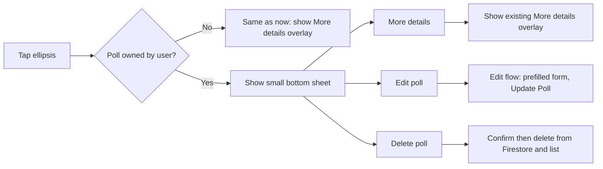

# Poll ellipsis: owner vs non-owner actions

## Current behavior

- **Ellipsis** lives in [PollCardView.swift](LinkUp/Polls/PollCardView.swift) (top-right overlay). It only appears when `onShowMoreDetails` is provided; currently only the **top card** gets it in [PollsView.swift](LinkUp/Polls/PollsView.swift) (lines 121–124).
- Tapping the ellipsis always sets `pollForMoreDetails = polls[0]`, which shows the full-screen **More details** overlay ([MoreDetailsPopupView](LinkUp/Polls/MoreDetailsPopupView.swift)).
- The **Poll** model in [Poll.swift](LinkUp/Polls/Poll.swift) has no `createdBy`; [PollService](LinkUp/Polls/PollService.swift) writes `createdBy` to Firestore when creating but does not return it on the in-memory `Poll`. There is no `updatePoll` or `deletePoll` API, and no edit flow.

## Target behavior

- **Other people's polls**: unchanged — tap ellipsis → show existing more-details overlay.
- **User's own poll**: tap ellipsis → present a **small bottom sheet** with three options:
  1. **More details** — dismiss sheet and show the same more-details overlay as today.
  2. **Edit poll** — dismiss sheet and present edit flow (reuse create form, prefilled; submit updates poll; button label "Edit Poll").
  3. **Delete poll** — dismiss sheet and show a confirmation dialog; on confirm, delete in Firestore and remove from the in-memory list.

## Implementation plan

### 1. Add ownership to Poll and creation path

- **Poll model** ([Poll.swift](LinkUp/Polls/Poll.swift)): Add `var createdBy: String? = nil` (optional so existing/hardcoded data remains valid). Keep it `Codable` so Firestore decode can populate it when we add a fetch later.
- **PollService.createPoll** ([PollService.swift](LinkUp/Polls/PollService.swift)): When building the returned `Poll`, set `createdBy: uid` so newly created polls are identifiable as the current user's. No change to Firestore document shape (already has `createdBy`).
- **ContentView / CreatePollView**: When inserting a newly created poll, the poll returned from `createPoll` will now carry `createdBy`; no call-site change required beyond ensuring the binding updates as today.
- **HardcodedPolls.sample**: Leave as-is (no `createdBy` or `createdBy: nil`). Those polls will be treated as "someone else's" (no owner sheet).

### 2. Ellipsis tap: branch on ownership in PollsView

- **PollCardView**: Replace optional `onShowMoreDetails: (() -> Void)?` with a single optional callback that receives the poll, e.g. `onEllipsisTapped: ((Poll) -> Void)?`. When the ellipsis is tapped, call `onEllipsisTapped?(poll)`. Show the ellipsis whenever this closure is non-nil.
- **PollsView**:
  - Pass something like: `onEllipsisTapped: { [poll = polls[0]] in … }` (or the current top poll) so the parent receives the poll.
  - In the handler: if `poll.createdBy != authState.currentUser?.id` (or `createdBy` is nil), keep current behavior: `pollForMoreDetails = poll`.
  - If `poll.createdBy == authState.currentUser?.id`, set a state variable to present the **owner actions sheet** (e.g. `pollForOwnerSheet: Poll?`). Do not set `pollForMoreDetails` in this case.

### 3. Owner actions sheet (small bottom sheet)

- Add a new view (e.g. **PollOwnerActionsSheet** or a private builder in PollsView) that shows a compact list of three rows:
  - "More details"
  - "Edit poll"
  - "Delete poll"
- Use a **sheet** with a small detent (e.g. `.presentationDetents([.height(180)])` or similar) so it feels like a "very small sheet". AuthTheme for background and text.
- **More details**: Button action dismisses the sheet and sets `pollForMoreDetails = poll` (and clears `pollForOwnerSheet`) so the existing more-details overlay appears.
- **Edit poll**: Dismiss the sheet, clear `pollForOwnerSheet`, and present the **edit poll** flow (next step) for this poll.
- **Delete poll**: Dismiss the sheet, clear `pollForOwnerSheet`, and present a **delete confirmation** alert/dialog. On confirm, call delete API and remove the poll from the `polls` binding (and close any overlay if the deleted poll was the one shown).

### 4. PollService: update and delete

- **updatePoll** in [PollService.swift](LinkUp/Polls/PollService.swift): Add a function that takes the poll id and the same inputs as create (question, optionTexts, activityDate, activityDescription, imageData). Verify the poll exists and (optionally) that `createdBy` matches the current user. Update the Firestore document and Storage if image changes; return the updated `Poll` (with `createdBy` set). Do not reset vote counts for existing options; if option set changes, define a simple strategy (e.g. replace options and keep counts where option id matches, or document that edit resets votes — recommend keeping counts for matching option ids).
- **deletePoll**: Add a function that takes poll id, checks ownership if desired, deletes the Firestore document (and optionally the Storage image). Caller is responsible for removing the poll from the local list.

### 5. Edit poll flow (reuse Create form)

- **CreatePollView** ([CreatePollView.swift](LinkUp/Polls/CreatePollView.swift)): Add an optional parameter for edit mode, e.g. `existingPoll: Poll? = nil`. When `existingPoll != nil`:
  - Prefill question, option texts (from `existingPoll.options`), activity date, description, and image URL (or leave image picker empty and allow replacing).
  - Submit button label: **"Edit Poll"** (not "Create Poll").
  - On submit: call `authState.updatePoll(...)` instead of `createPoll`, then call a callback like `onUpdated(Poll)` (or reuse `onCreated` with the updated poll) and dismiss.
- **PollsView** (or ContentView): When user chooses "Edit poll" from the owner sheet, present this view (e.g. as a sheet) with `existingPoll: poll`. On update, replace the poll in the `polls` array (find by id and update) and dismiss the edit sheet. Ensure the updated poll still has `createdBy` so it remains "own poll".

### 6. Delete confirmation and list update

- After "Delete poll" and user confirms: call `authState.deletePoll(pollId)`, remove the poll from the `polls` binding (ContentView owns the array; pass a callback from ContentView to PollsView if needed, e.g. `onDeletePoll: (Poll) -> Void` or `onDeletePollId: (String) -> Void`). If the deleted poll was the one in `pollForMoreDetails`, set `pollForMoreDetails = nil`. If the deck becomes empty, the existing empty state already handles that.

### 7. Firestore / security (optional in plan)

- If you have or will add Firestore rules for `polls`, ensure only the creator can update and delete (e.g. `request.auth.uid == resource.data.createdBy` for update/delete). No code change in the app required for this plan beyond implementing the APIs.

## Files to touch (summary)

| Area                 | Files                                                                                                                                                           |
| -------------------- | --------------------------------------------------------------------------------------------------------------------------------------------------------------- |
| Model                | [Poll.swift](LinkUp/Polls/Poll.swift) — add `createdBy`                                                                                                         |
| Service              | [PollService.swift](LinkUp/Polls/PollService.swift) — set createdBy on created Poll; add updatePoll, deletePoll                                                 |
| Card                 | [PollCardView.swift](LinkUp/Polls/PollCardView.swift) — ellipsis callback to `(Poll) -> Void`                                                                   |
| Main deck            | [PollsView.swift](LinkUp/Polls/PollsView.swift) — branch on ownership; owner sheet state; present edit sheet; delete confirmation; wire More details from sheet |
| Create/Edit          | [CreatePollView.swift](LinkUp/Polls/CreatePollView.swift) — optional existingPoll, prefill, "Edit Poll" button, updatePoll on submit                            |
| Navigation/callbacks | [ContentView.swift](LinkUp/ContentView.swift) — if delete/update callbacks are easiest at this level, add onDeletePoll/onUpdatePoll and pass to PollsView       |

## Order of work

1. Add `createdBy` to Poll and set it in createPoll return value.
2. Add updatePoll and deletePoll to PollService.
3. PollCardView: switch to `onEllipsisTapped(Poll)`; PollsView: branch on ownership, add owner sheet state and small sheet UI.
4. Wire "More details" from owner sheet to existing overlay.
5. CreatePollView: add edit mode (existingPoll, prefill, Edit Poll button, updatePoll).
6. PollsView/ContentView: wire "Edit poll" to present CreatePollView in edit mode and refresh list on update.
7. Delete confirmation UI and call deletePoll; remove poll from list and clear overlay if needed.

