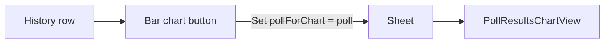

# Poll results chart sheet

## Current state

- **[LinkUp/Polls/PollHistoryView.swift](LinkUp/Polls/PollHistoryView.swift)** – History page with a list of polls. Each row has a bar chart icon (`chart.bar.fill`) with an **empty** `Button` action (lines 87–93) and text `"\(poll.question) - \(poll.totalVoteCount) votes"`.
- **Poll data** – [LinkUp/Polls/Poll.swift](LinkUp/Polls/Poll.swift): `Poll` has `question` and `options: [PollOption]`; each `PollOption` has `text` and `count`. No chart library in use; charts will be custom SwiftUI.

## Goal

- Tapping the **bar chart icon** on a history row opens a **sheet**.
- Sheet shows a **large vertical bar chart** for that poll: one vertical bar per option, option label **below** each bar, **count only** (e.g. "Yes — 5").
- Sheet **title** = poll question (e.g. "Climbing?").
- Styling: **AuthTheme** (background, primary/secondary text, accent for bars). Dismiss by swipe or a clear close/done control.

---

## 1. Sheet presentation from Poll History

**File: [LinkUp/Polls/PollHistoryView.swift](LinkUp/Polls/PollHistoryView.swift)**

- Add `@State private var pollForChart: Poll? = nil`.
- In the bar chart `Button` action (currently empty), set `pollForChart = poll`.
- Add `.sheet(item: $pollForChart)` presenting a new **PollResultsChartView** with the selected poll. Use `item:` so the sheet gets the associated `Poll` and only presents when non-nil. (`Poll` is already `Identifiable`, so this works.)
- Optional: use the same sheet host pattern as Settings (e.g. toolbar with "Done" or "Back" in accent) for consistent dismiss UX; swipe-to-dismiss remains available by default.

---

## 2. New view: PollResultsChartView (vertical bar chart)

**New file: [LinkUp/Polls/PollResultsChartView.swift](LinkUp/Polls/PollResultsChartView.swift)**

- **Input:** `poll: Poll` (passed from the sheet).
- **Title:** Set the sheet’s navigation/toolbar title to `poll.question`.
- **Dismiss:** Toolbar trailing (or leading) "Done" / "Close" button using `@Environment(\.dismiss)` and `AuthTheme.accent`.
- **Chart:**
  - **Vertical bars:** One bar per `poll.options`. Each bar is a vertical `RoundedRectangle` (or rectangle) whose **height** is proportional to `option.count` (e.g. scale so the option with the max count uses a sensible max height; if all counts are 0, show short/zero-height bars).
  - **Layout:** e.g. `HStack(spacing: ...)` of bar units; each unit = `VStack` of: (1) optional count label on top, (2) bar (aligned to bottom), (3) option text below. Use `AuthTheme.accent` for bar fill, `AuthTheme.primary` for labels, `AuthTheme.secondary` for optional subtitles.
  - **Count only:** Show the number (e.g. "5") per option; no percentage (per your choice).
- **Empty state:** If `poll.totalVoteCount == 0`, show a short message (e.g. "No votes yet") in `AuthTheme.secondary` instead of or above the chart.
- **Styling:** Background `AuthTheme.background`; typography via `Typography` where applicable; keep spacing and padding consistent with the rest of the app.

Implementation detail for bar height: compute `maxCount = poll.options.map(\.count).max() ?? 1` (use 1 to avoid division by zero). For each option, bar height = `(CGFloat(option.count) / CGFloat(maxCount)) * maxBarHeight` where `maxBarHeight` is a fixed value or derived from `GeometryReader` so the chart fits nicely in the sheet.

---

## 3. Project and flow

- Add **PollResultsChartView.swift** to the Xcode project (LinkUp target) so it compiles.
- Flow: **History list** → tap bar chart icon on a row → **sheet** presents with **PollResultsChartView(poll: thatPoll)** → user sees poll question as title and vertical bar chart with count-only labels → user dismisses via "Done" or swipe.

---

## Files to touch

| File                                                                               | Change                                                                                                                                                              |
| ---------------------------------------------------------------------------------- | ------------------------------------------------------------------------------------------------------------------------------------------------------------------- |
| [LinkUp/Polls/PollHistoryView.swift](LinkUp/Polls/PollHistoryView.swift)           | Add `pollForChart` state; bar chart button sets it; `.sheet(item: $pollForChart)` presenting `PollResultsChartView`.                                                |
| [LinkUp/Polls/PollResultsChartView.swift](LinkUp/Polls/PollResultsChartView.swift) | **New.** Sheet content: title = poll question, Done button, vertical bar chart (one bar per option, label below, count only), AuthTheme, empty state when no votes. |
| LinkUp.xcodeproj/project.pbxproj                                                   | Add `PollResultsChartView.swift` to the target.                                                                                                                     |

No changes to the `Poll` model or to navigation paths; the chart is read-only from existing `poll.options` and `option.count`.