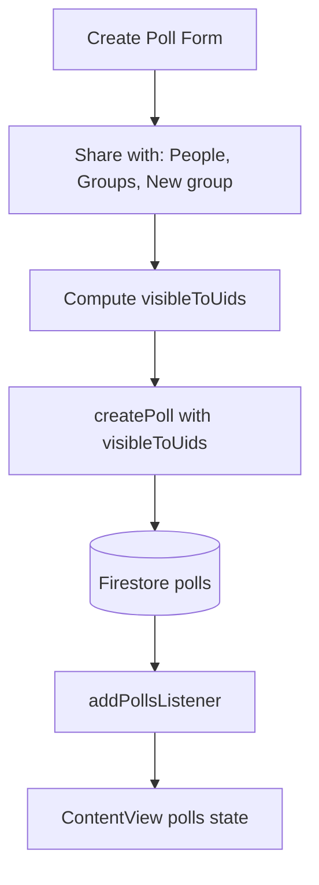

# Poll visibility: friends and groups

## Goal

Polls are visible only to users the creator explicitly shares with. When creating a poll, the user chooses:

- **People:** Multi-select from friends
- **Groups:** Multi-select from existing group conversations (Messages)
- **New group:** Create a new group conversation (name + members) and share the poll with it

Visibility is stored on each poll; the poll list is fetched from Firestore filtered by membership.

---

## 1. Data model changes

**File: [LinkUp/Polls/Poll.swift](LinkUp/Polls/Poll.swift)**

- Add `visibleToUids: [String]` to `Poll` (Codable). This list always includes `createdBy`; the rest are the union of: selected friend UIDs, all `participantIds` from selected groups, and all `participantIds` from any newly created group.
- Update `PollDocument` in PollService to include `visibleToUids`.

---

## 2. Firestore structure and rules

**Firestore:** Keep top-level `polls` collection. Each poll document gets `visibleToUids: [String]`.

**File: [firestore.rules](firestore.rules)**

- Change poll read rule from `request.auth != null` to:
  - `request.auth != null && request.auth.uid in resource.data.visibleToUids`
- Create rule unchanged; update rule for voting unchanged; delete rule unchanged.

**File: [firestore.indexes.json](firestore.indexes.json)** (if needed)

- Add composite index for `polls` where `visibleToUids` array-contains and `createdAt` descending (for ordered feed). Firestore may auto-suggest if missing.

---

## 3. PollService: create and fetch

**File: [LinkUp/Polls/PollService.swift](LinkUp/Polls/PollService.swift)**

- **createPoll:** Add parameter `visibleToUids: [String]`. Ensure it includes `createdBy`. Encode and store on the poll document.
- **fetchPolls(uid: String):** New method. Query `polls` where `visibleToUids` array-contains `uid`, ordered by `createdAt` descending. Decode and return `[Poll]`.
- **addPollsListener(uid: String, onUpdate: ([Poll]) -> Void):** New method. Real-time listener for the same query. Returns `ListenerRegistration` for cleanup.

---

## 4. Create Poll: "Share with" UI

**File: [LinkUp/Polls/CreatePollView.swift](LinkUp/Polls/CreatePollView.swift)**

Add a "Share with" section (after photo, before submit) with three modes:

- **People:** Multi-select from friends. Fetch friends via `authState.fetchFriends(uid:)` in `.task`. Use a list with checkmarks (similar to CreateGroupView friend picker).
- **Groups:** Multi-select from user's group conversations. Fetch via a one-off query or new `AuthState.fetchMyGroupConversations(uid:)` that returns conversations where `participantIds` contains uid and `type == .group`.
- **New group:** Button or inline flow: enter group name, multi-select friends, then call `authState.createGroupConversation(name:participantIds:createdBy:)`. Add returned `participantIds` to the visibility set.

**State:** `@State private var selectedFriendUids: Set<String> = []`, `@State private var selectedGroupIds: Set<String> = []`, `@State private var newGroupParticipantIds: [String] = []` (if creating new group inline). Before submit, compute `visibleToUids = [createdBy] + selectedFriendUids + (participantIds from selected groups) + newGroupParticipantIds`. Pass to `createPoll`.

**Validation:** At least one share target (person, group, or new group) must be selected; otherwise show error.

---

## 5. Services: fetch groups for picker

**File: [LinkUp/Messages/MessagesService.swift](LinkUp/Messages/MessagesService.swift)** or new helper

- Add `fetchMyGroupConversations(uid: String) async throws -> [Conversation]`: Query `conversations` where `participantIds` array-contains uid. Filter client-side for `type == .group`. Return list for the "Groups" picker.

---

## 6. App wiring: load polls from Firestore

**File: [LinkUp/ContentView.swift](LinkUp/ContentView.swift)**

- Replace `@State private var polls: [Poll] = HardcodedPolls.sample` with `@State private var polls: [Poll] = []`.
- On appear (or when user logs in), attach `addPollsListener` for the current user's uid. On update, set `polls = result`.
- When creating a poll, still call `onCreated(poll)` to insert locally for instant feedback, but the listener will overwrite with authoritative data. (Or rely only on listener; brief delay is acceptable.)
- Remove or gate hardcoded polls (e.g. only use when no listener data yet for empty state).

**File: [LinkUp/ContentView.swift](LinkUp/ContentView.swift)** – Plus sheet `onCreated`

- Either remove local insert and rely on listener, or keep insert for snappiness (listener will reconcile).

---

## 7. Edit poll and visibility

**File: [LinkUp/Polls/CreatePollView.swift](LinkUp/Polls/CreatePollView.swift)** (edit mode)

- When editing an existing poll, pre-fill "Share with" from `existingPoll.visibleToUids` (resolve UIDs to friends/groups for display; this may be approximate). Allow changing visibility. `PollService.updatePoll` must accept and persist `visibleToUids`.

**File: [LinkUp/Polls/PollService.swift](LinkUp/Polls/PollService.swift)**

- `updatePoll`: Add `visibleToUids: [String]` parameter; include in the encoded document.

---

## 8. Flow summary

---

## 9. Files to touch

| File                                                                           | Change                                                                     |
| ------------------------------------------------------------------------------ | -------------------------------------------------------------------------- |
| [LinkUp/Polls/Poll.swift](LinkUp/Polls/Poll.swift)                             | Add `visibleToUids: [String]`                                              |
| [firestore.rules](firestore.rules)                                             | Restrict poll read to `uid in visibleToUids`                               |
| [firestore.indexes.json](firestore.indexes.json)                               | Add index if Firestore requires it                                         |
| [LinkUp/Polls/PollService.swift](LinkUp/Polls/PollService.swift)               | createPoll/updatePoll take visibleToUids; add fetchPolls, addPollsListener |
| [LinkUp/Polls/CreatePollView.swift](LinkUp/Polls/CreatePollView.swift)         | Add Share with section: people picker, groups picker, new group flow       |
| [LinkUp/Messages/MessagesService.swift](LinkUp/Messages/MessagesService.swift) | Add fetchMyGroupConversations                                              |
| [LinkUp/ContentView.swift](LinkUp/ContentView.swift)                           | Use polls listener; remove hardcoded default                               |

---

## 10. Migration and hardcoded data

- Existing polls in Firestore without `visibleToUids` will fail the new read rule. Options: (a) backfill scripts to add `visibleToUids` to existing docs, or (b) rules that allow read if `visibleToUids` is missing (legacy) or if `uid in visibleToUids`. Prefer backfill so all polls have explicit visibility.
- `HardcodedPolls.sample`: Remove as default feed. Use only for Previews or when signed out. Signed-in users see only Firestore polls they are in `visibleToUids` for.

