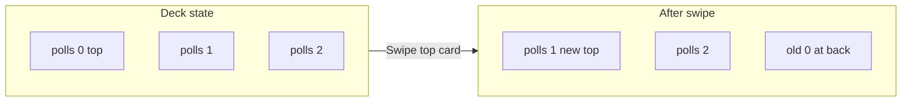

# Polls design update: one per page, deck of cards, change vote anytime

## Goals

1. **One poll per page** — Only the current (top) poll is visible and interactive at a time.
2. **Deck of cards** — Polls are presented as a stack; swiping the top card sends it to the back of the deck and reveals the next card.
3. **Change vote anytime** — User can switch their selection on the current poll at any time (no “locked” state after voting).

## Current implementation (reference)

- **[PollsView.swift](LinkUp/Polls/PollsView.swift)** — ScrollView with a VStack of all poll cards; staggered reveal; header. Single source of truth: `@State private var polls: [Poll]`.
- **[PollCardView.swift](LinkUp/Polls/PollCardView.swift)** — One card UI with question, vote count, options, progress bar. **Currently:** `hasVoted` disables other options and blocks further taps (`guard !hasVoted`); only one vote per poll, no way to change.

---

## 1. One poll per page + deck model

- **Data model:** Keep `polls: [Poll]` as an ordered array representing the deck. **Top of deck = index 0.** No separate “current index” needed if we reorder on swipe.
- **View structure:** Replace the ScrollView + VStack of all cards with a view that shows only the **top** poll as the main, full-size card. Optionally show one or two cards “behind” it with reduced scale and offset to suggest a stack (see next section).
- **Empty / single-poll:** If the deck has 0 polls, show an empty state. If 1 poll, swiping it still sends it to the back (deck cycles).

---

## 2. Deck-of-cards visual and swipe interaction

- **Stack effect (optional but recommended):** Use a ZStack. Draw cards from back to front so the top card is last in the ZStack. For the top card only: full size, interactive, and attach the swipe gesture. For cards “behind”: same `PollCardView` (or a placeholder) with e.g. `.scaleEffect(0.95)` and `.offset(y: 8)` (or similar) so the stack is visible. Limit to 2–3 visible cards to avoid clutter.
- **Swipe gesture:** On the **top** card only, add a **DragGesture** (horizontal). On gesture end:
  - If translation or velocity exceeds a threshold (e.g. 100pt or similar), treat as “swipe to dismiss.”
  - **Animation:** Animate the top card moving off-screen (e.g. to the left: `offset(x: -screenWidth)` and optional opacity).
  - **Deck update:** Move the top poll to the back: `polls = Array(polls.dropFirst()) + [polls[0]]` (or equivalent). The next poll becomes `polls[0]` and is now the new top card.
  - **Reveal:** Animate the new top card into place (e.g. from a slight right offset or scale so it “lands” as the new top). Optionally reset any per-card animation state for the new top.
- **Direction:** Prefer one clear direction (e.g. “swipe left to send to back”) so the metaphor is consistent. Right swipe could be ignored or used for “undo” (bring last card back) later if desired; for this plan, only “swipe to back” is required.

---

## 3. Change vote anytime (PollCardView)

- **Remove “disabled after vote”:** Remove the logic that disables the non-selected options once the user has voted. Delete or relax:
  - `hasVoted`-based `.disabled(isDisabled)` and `.opacity(isDisabled)` on option buttons.
  - The `guard !hasVoted else { return }` in the button action.
- **Vote-change logic:** When the user taps an option:
  - If the tapped option is already selected (`selectedOptionId == option.id`): no-op.
  - If another option was selected: **decrement** the previously selected option’s count, then **set** `selectedOptionId` to the new option and **increment** that option’s count. Update the `poll` binding so the UI and progress bar reflect the change.
  - If none was selected: set `selectedOptionId` and increment the tapped option’s count (current behavior).
- **Tap feedback and progress animation:** Keep existing tap scale animation and progress bar animation when counts change. The progress bar will animate when the user switches votes (one segment shrinks, another grows).

---

## 4. What stays the same

- **Card design:** Existing [PollCardView](LinkUp/Polls/PollCardView.swift) styling (background, border, accent bar by “X votes”, progress bar, checkmark on selected option, tap animation). No need to change visuals beyond making the top card full-width/full-height as the only main content.
- **Header:** Keep the existing polls header (profile, username, chart, settings) in [PollsView](LinkUp/Polls/PollsView.swift). It stays above the deck.
- **Theme:** All colors and typography remain AuthTheme-only ([app theme rules](.cursor/rules/app-theme-colors.mdc)).
- **Data:** Still in-memory only; no Firestore or API changes. [Poll](LinkUp/Polls/Poll.swift) and [HardcodedPolls](LinkUp/Polls/Poll.swift) unchanged.

---

## 5. Implementation order

1. **PollCardView** — Implement “change vote anytime”: remove disabled-after-vote, add vote-change logic (decrement previous, increment new). Verify progress bar and selection state update correctly when switching options.
2. **PollsView** — Replace list with deck: show only top poll (and optional 1–2 behind with scale/offset). Implement deck reorder on swipe (gesture + animation + `polls` update). Keep header and existing layout constants.

---

## 6. Files to touch

| File                                                               | Changes                                                                                                                                                                                                                                                                                                      |
| ------------------------------------------------------------------ | ------------------------------------------------------------------------------------------------------------------------------------------------------------------------------------------------------------------------------------------------------------------------------------------------------------ |
| [LinkUp/Polls/PollCardView.swift](LinkUp/Polls/PollCardView.swift) | Allow changing vote: remove hasVoted guard and disabled state; on option tap, if switching selection decrement previous option count and increment new.                                                                                                                                                      |
| [LinkUp/Polls/PollsView.swift](LinkUp/Polls/PollsView.swift)       | One poll per page: replace ScrollView list with deck view (top card = polls[0], optional stack behind). Add DragGesture on top card; on swipe threshold, animate top card off, reorder polls (first to last), animate new top into place. Remove or repurpose staggered-reveal (e.g. only for new top card). |

---

## 7. Out of scope

- Backend or Firestore integration.
- Changing AuthTheme or adding new colors.
- Bottom tab bar or navigation structure.
- “Undo” (swipe right to bring last card back).

