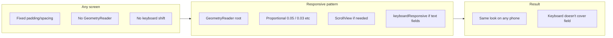

# Responsive design pattern for any screen (LinkUp)

Use this pattern on **any** screen—auth, settings, profile, feeds, etc.—so layout scales across device sizes and the keyboard doesn't cover focused fields.

**Core idea:** **GeometryReader** at the root, **proportional** padding and spacing (e.g. % of width/height), **ScrollView** where content can overflow, and **.keyboardResponsive()** on screens that have text fields.




---

## Prerequisites (one-time)

Before applying the pattern to a screen, the project should have:

1. `**LinkUp/GeometryReader.swift**` (or equivalent) with:
  - `KeyboardResponsiveModifier`: `ViewModifier` that adds bottom padding equal to keyboard height, subscribing to `keyboardWillShowNotification` / `keyboardWillHideNotification`.
  - Extension: `func keyboardResponsive() -> some View { self.modifier(KeyboardResponsiveModifier()) }`.
2. **(Optional)** A shared **Typography** or spacing constants if you want consistent font/sizing across screens.

If these don't exist, add them first; then use the procedure below on any screen.

---

## How to make a screen responsive

Apply these steps to **whatever view/screen** you're working on (e.g. LogInView, SignUpView, SettingsView, ProfileView, ContentView, etc.).

### 1. Wrap the screen body in GeometryReader

```swift
var body: some View {
  GeometryReader { geometry in
    // main content here; use geometry.size for all dimensions
  }
}
```

Use `geometry` for all padding and spacing so the screen scales with device size.

### 2. Use proportional padding and spacing

- **Root padding:**  
`.padding(.horizontal, geometry.size.width * 0.05)`  
`.padding(.vertical, geometry.size.height * 0.05)`  
(Adjust factors as needed, e.g. 0.04–0.06.)
- **Stack spacing:**  
Prefer proportions instead of magic numbers, e.g.:  
  - `VStack(spacing: geometry.size.height * 0.03)`  
  - `VStack(spacing: geometry.size.height * 0.02)`  
  - `HStack(spacing: geometry.size.width * 0.02)`
- **Alignment / offsets:**  
Replace fixed values (e.g. 37, 12, 24) with expressions like `geometry.size.height * 0.045` or `geometry.size.width * 0.03` so they scale.

### 3. Use ScrollView where content can overflow

- Wrap the **scrollable** part (title, form, list, cards, etc.) in a `ScrollView`.
- Keep fixed footers (e.g. "Don't have an account?", primary action button) **outside** the `ScrollView` so they stay at the bottom, or put them inside the scroll if that fits your design.
- Use a single main container (e.g. `VStack`) with the scroll and optional footer; avoid relying on fixed `Spacer()` for layout when content can grow.

### 4. Add .keyboardResponsive() when the screen has text fields

- Apply `.keyboardResponsive()` to the **main container** that should shift up (e.g. the root `VStack` or the view that has the root padding).
- Use it on screens that contain `TextField` / `SecureField` (or other focusable inputs) so the focused field stays visible when the keyboard appears.
- Screens with no text fields don't need `.keyboardResponsive()`.

### 5. Verify the app compiles

After changes, run a build and fix any compile errors before considering the screen done.

---

## Example structure (any screen)

```swift
var body: some View {
  GeometryReader { geometry in
    VStack(spacing: geometry.size.height * 0.03) {
      ScrollView {
        VStack(spacing: geometry.size.height * 0.02) {
          // title, form, list, etc.
        }
      }
      // optional fixed footer
    }
    .padding(.horizontal, geometry.size.width * 0.05)
    .padding(.vertical, geometry.size.height * 0.05)
    .keyboardResponsive()  // only if screen has text fields
  }
}
```

Adjust structure (e.g. `HStack`, sections, nested `ScrollView`) to match the screen; keep the ideas: **GeometryReader**, **proportional values**, **ScrollView** for overflow, **keyboardResponsive** when there are text fields.

---

## Testing

- Build and run on several simulators (e.g. small, standard, large iPhone; optionally iPad).
- On each: open the screen and check spacing, alignment, and that nothing is clipped.
- If the screen has text fields: show the keyboard and confirm the content shifts so the focused field stays visible.

---

## Summary


| Do this                                            | So that                                                |
| -------------------------------------------------- | ------------------------------------------------------ |
| GeometryReader at root                             | Padding and spacing can use `geometry.size` and scale. |
| Proportional padding/spacing                       | Same relative look on any device size.                 |
| ScrollView for main content                        | Long or form-like content doesn't get clipped.         |
| .keyboardResponsive() (when there are text fields) | Keyboard doesn't cover the active field.               |
| Verify build after changes                         | No broken or non-compiling code.                       |


Use this pattern on **every new or refactored screen** so the app stays responsive as it grows.
