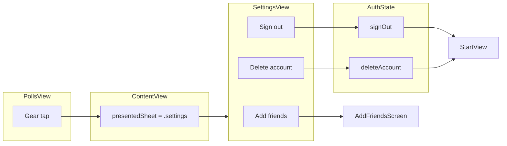

# Settings page – simple button plan

## Goal

One simple Settings screen, opened from the gear icon in the polls header, with a minimal set of actions.

## Recommended buttons (keep it simple)

| Button             | Action                                                                                                                                                                                                                                                                 |
| ------------------ | ---------------------------------------------------------------------------------------------------------------------------------------------------------------------------------------------------------------------------------------------------------------------- |
| **Add friends**    | Opens a screen to add friends (e.g. search by username, send request). Can start as a placeholder "Add friends" screen; real friend logic (Firestore, requests) can be added later.                                                                                    |
| **Sign out**       | Signs the user out (Firebase Auth + clear `userSession` / `currentUser`). Dismisses Settings; [StartView](LinkUp/StartView.swift) shows [LogInView](LinkUp/Authentication/LogInView.swift) when `userSession == nil`.                                                  |
| **Delete account** | Destructive: show confirmation alert ("Delete account? This cannot be undone."). On confirm: delete Firebase Auth user, Firestore `users/<uid>` and `usernames/<username>` claim, Storage `profile_images/<uid>.jpg`; then clear session so StartView shows LogInView. |

Optional later:

- **About** – app name + version (e.g. from `Bundle.main`), static copy only.

---

## Implementation outline

1. **Auth: Sign out**
  - In [AuthState](LinkUp/Authentication/AuthState.swift) (or its [AuthViewModel](LinkUp/Authentication/AuthViewModel.swift) extension): add `func signOut()` that:
    - Calls `try? authRef.signOut()`
    - Sets `userSession = nil` and `currentUser = nil` on the main actor.
  - [StartView](LinkUp/StartView.swift) already branches on `authState.userSession != nil`, so no change there.
2. **Presenting Settings**
  - Add `**.settings**` to the existing [AppSheet](LinkUp/ContentView.swift) enum in ContentView.
  - Add a case in `sheetContent(for:)` that presents a **SheetHost(title: "Settings")** wrapping a new **SettingsView(authState: authState)**.
  - ContentView owns `presentedSheet` but PollsView has the gear button. So:
    - Pass a closure from ContentView to PollsView, e.g. `onOpenSettings: { presentedSheet = .settings }`, and call it when the gear is tapped; **or**
    - Use a small observable (e.g. a `@Published var showSettings: Bool` on AuthState or a dedicated object) that ContentView observes and maps to `presentedSheet = .settings`.
  - Recommendation: **closure** – minimal and explicit.
3. **Settings UI**
  - New **SettingsView** (e.g. in `LinkUp/Authentication/SettingsView.swift` or `LinkUp/Settings/SettingsView.swift`).
  - Same look as the rest of the app: [AuthTheme](LinkUp/Authentication/AuthTheme.swift) (background, primary, accent).
  - Layout: list or vertical stack of buttons (order: Add friends, Sign out, Delete account).
  - **Add friends**: button that opens an "Add friends" screen (new sheet or pushed view). Can be a placeholder view at first (e.g. "Add friends – coming soon" or a simple search-by-username UI stub).
  - **Sign out**: on tap call `authState.signOut()`, then `dismiss()`; StartView will show LogInView.
  - **Delete account**: destructive style (e.g. red or accent). On tap show confirmation alert; on confirm call a new `authState.deleteAccount()` then `dismiss()`.
  - Optional **About**: static text or row with app version; no navigation.
4. **Delete account (backend)**
  - In [AuthState](LinkUp/Authentication/AuthState.swift) / [AuthViewModel](LinkUp/Authentication/AuthViewModel.swift): add `func deleteAccount() async throws` that:
    - Uses current user's `uid` and (from `currentUser`) `username` (normalized).
    - Deletes Storage object `profile_images/<uid>.jpg` (ignore "not found").
    - Deletes Firestore `users/<uid>` and `usernames/<normalizedUsername>`.
    - Calls `authRef.currentUser?.delete()` (Firebase Auth delete user).
    - Sets `userSession = nil` and `currentUser = nil`.
  - SettingsView calls it inside a `Task` and dismisses on success; optional error alert on failure (e.g. re-auth required).
5. **Wiring the gear**
  - In [PollsView](LinkUp/Polls/PollsView.swift): replace `// TODO: open settings` with a call to the new closure (e.g. `onOpenSettings()`).
  - In [ContentView](LinkUp/ContentView.swift): when creating PollsView, pass `onOpenSettings: { presentedSheet = .settings }` (or equivalent).

---

## Flow (mermaid)

---

## Files to add or touch

| File                                                                                                            | Change                                                                                                                                     |
| --------------------------------------------------------------------------------------------------------------- | ------------------------------------------------------------------------------------------------------------------------------------------ |
| [AuthState](LinkUp/Authentication/AuthState.swift) / [AuthViewModel](LinkUp/Authentication/AuthViewModel.swift) | Add `signOut()`; add `deleteAccount() async throws` (Storage + Firestore + Auth user delete, then clear session).                          |
| New: `LinkUp/Authentication/SettingsView.swift` (or `LinkUp/Settings/SettingsView.swift`)                       | New view: buttons **Add friends**, **Sign out**, **Delete account** (with confirmation alert). AuthTheme; receives `authState`, `dismiss`. |
| New (optional): Add friends placeholder view                                                                    | Simple "Add friends" screen (placeholder or stub UI); opened from Settings (e.g. sheet or navigation).                                     |
| [LinkUp/ContentView.swift](LinkUp/ContentView.swift)                                                            | Add `AppSheet.settings`; case in `sheetContent(for:)` for Settings; pass `onOpenSettings` into PollsView.                                  |
| [LinkUp/Polls/PollsView.swift](LinkUp/Polls/PollsView.swift)                                                    | Add `onOpenSettings: () -> Void`; call it from the gear button.                                                                            |

---

## Summary

- **Buttons:** **Add friends** (opens Add friends screen, placeholder OK at first), **Sign out**, **Delete account** (with confirmation; calls new `deleteAccount()`).
- **Sign out:** `signOut()` in auth layer; clears session; StartView shows LogInView.
- **Delete account:** `deleteAccount()` removes Storage profile image, Firestore user + usernames claim, and Firebase Auth user; then clear session.
- **Settings screen:** New view with the three buttons, AuthTheme, presented as a sheet from the gear in PollsView (closure from ContentView).

